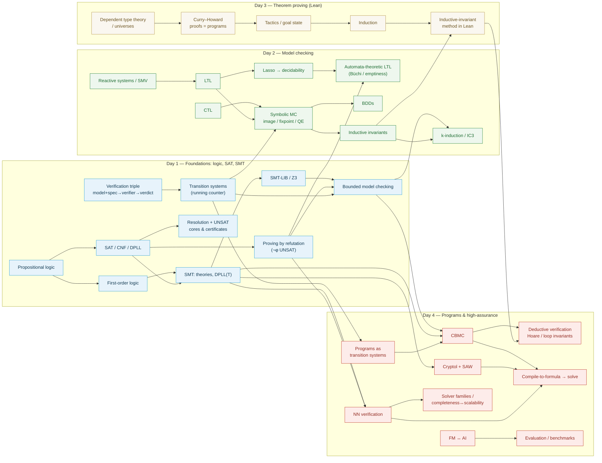

# FMAIV — Topic Dependency Graph & Order Check

*A concept-dependency map of the 4-day course (analogous to the 6315 knowledge graph) to sanity-check teaching order. An edge `A --> B` means "A is a prerequisite for B / should be taught before B." Colored by day. Companion to [`COURSE_GAP_ANALYSIS.md`](COURSE_GAP_ANALYSIS.md).*

*Render the Mermaid block on GitHub, in VS Code (Markdown Preview Mermaid Support), or at mermaid.live.*

## Dependency graph

## Per-day ordered spine (what depends on what)

- **Day 1:** motivation → **verification triple / picture** → propositional & first-order logic → **transition systems** (running counter) → SAT (CNF, DPLL) → **proving by refutation** → resolution + cores/certificates → SMT (DPLL(T)) → SMT-LIB/Z3 → **bounded model checking**. *Foundations everything else builds on; the counter and "assert the negation" thread forward.*
- **Day 2:** reactive systems/SMV → LTL/CTL → lasso → **automata-theoretic LTL** → symbolic MC (image/fixpoint/QE) → BDDs → **inductive invariants** → **k-induction/IC3**. *Reuses transition systems + BMC + refutation from Day 1.*
- **Day 3:** dependent type theory → **Curry–Howard** → tactics/goal-state → induction → **inductive-invariant method in Lean**. *Cashes out Day 2's inductive invariants as machine-checked proofs.*
- **Day 4:** programs as transition systems → CBMC → **deductive verification (Hoare/invariants)** → Cryptol+SAW → NN verification → solver families/completeness → **compile-to-formula unifier** → FM↔AI → **evaluation/benchmarks**. *Ties Days 1–3 to real code; the unifier slide makes the "all one shape" point explicit.*

## Order audit — findings

Backbone is sound: Day 1 foundations → Day 2 MC → Day 3 proof → Day 4 programs, with the *transition-system* model and the *assert-the-negation* move threaded throughout (Day 1 refutation → Day 2 `L(K)∩L(¬φ)=∅` and `J∧R∧¬J′` → Day 4 unifier). Specific notes:

1. **Z3 3-coloring live demo precedes SAT/SMT theory** (Day 1 slide ~474 vs SAT ~1012, SMT-LIB ~1351). *Intentional motivational teaser* ("AI proposes, kernel disposes"); the next slide already says "we define these properly next block," and I added a one-line forward-reference to the demo itself. **Status: OK / mitigated.** If you'd rather, move the demo to just after the SMT-LIB slide.
2. **Automata-theoretic LTL (Büchi) sits in the LTL-on-traces section** (~slide after the lasso) rather than in the later "three model-checking algorithms" block. It flows naturally from the lasso (its conceptual hook), so I placed it there. **Optional:** move it next to explicit-state model checking in the algorithms block if you prefer all algorithms grouped.
3. **Inductive invariants are introduced on Day 2, used as a *method* on Day 3, and cashed out as *deductive verification* on Day 4.** This is the right order; the Day 2 slide forward-references Day 3 explicitly, and the new Day 4 deductive slide links back. **Status: good** (this chain is now a deliberate spine, not an accident).
4. **The verification-triple table forward-references "Hoare triple" and "inductive invariant"** (Day 4 terms) as Day-4 row labels. It's a roadmap table, so this is acceptable; the terms are properly defined when reached.
5. **BDDs come after symbolic MC** (symbolic sets first, then their data structure) — correct.

**Net:** no hard ordering bugs (no concept is *used* before it's *introduced* on the critical path). The one genuine "introduced later than you'd expect" item is the Z3 demo (#1), which is a deliberate teaser and now flagged in-slide. Items #2 is a placement preference for you to decide.
