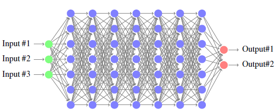
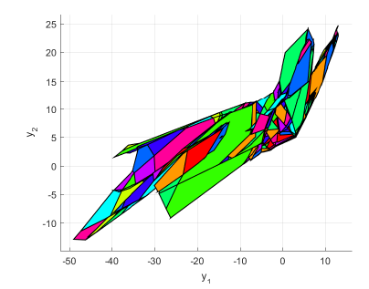
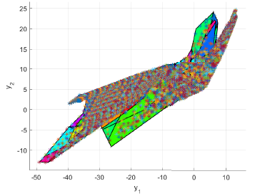

# Day 4 — Programs & the Frontier {.title}

## CBMC, Cryptol, SAW, and where the field is going {.section}

**Run it live (no install):** [Codespaces](https://codespaces.new/ttj/fmaiv) (full toolset) or Colab — today's notebook [`04_day4_program_verif`](https://colab.research.google.com/github/ttj/fmaiv/blob/main/notebooks/04_day4_program_verif.ipynb), plus the frontier NN notebooks [`05_nn_robustness`](https://colab.research.google.com/github/ttj/fmaiv/blob/main/notebooks/05_day4_nn_robustness.ipynb) · [`06_nn_mnist`](https://colab.research.google.com/github/ttj/fmaiv/blob/main/notebooks/06_day4_nn_mnist.ipynb). All materials: <https://github.com/ttj/fmaiv>

::: notes
Days 1-3 verified models of the counter — an SMT formula, an SMV transition system, a Lean proof. Today we connect verification to *actual source code* (CBMC on C, Cryptol/SAW on C-vs-spec), and close with the research frontier: neural-network verification and how industry runs all of this at production scale. The counter appears one last time, in C and in Cryptol — its fourth and fifth encodings.
:::

---

## Where we are

Three views of the same counter so far:

| Day | Model | Guarantee |
|---|---|---|
| 1 | Z3 / SMT formula | no counterexample of length ≤ N |
| 2 | nuXmv / SMV | no counterexample, ever (finite state) |
| 3 | Lean / induction | machine-checked proof, any bound |

Today: the same ideas, applied to **real code**.

::: notes
Recap the arc as a table. Each row is a stronger or different guarantee on the *same system*. The gap we close today: all three operated on a *model* of the counter. Real engineering needs verification of the actual artifact — the C source, the deployed crypto routine. That is what CBMC and SAW do.
:::

---

## Fresh from yesterday: an AI-discovered theorem, kernel-checked in a week

Day 3 closed on the **AI proposes, the kernel disposes** thesis — PFR, AlphaProof, DeepSeek-Prover. **News from this week:**

- **The result.** OpenAI's research stack announced a **disproof of Paul Erdős' planar unit-distance conjecture** (May 20, 2026) — a long-open extremal-geometry problem we flagged on Day 3 as *generated but not yet formalized*.
- **Then.** Logical Intelligence's **Aleph Prover** delivered a public **Lean 4** formalization (blog dated 2026-05-29) — i.e. **~9 days end-to-end** — with professional mathematicians (Kevin Buzzard, Sergey Galkin, others) validating along the way.
- **Scale.** ~**33,000 lines** of Lean, ~**252 Mathlib modules**, conditional on **two** explicit class-field-theory inputs (Golod–Shafarevich + Shafarevich's relation-rank bound) — reduced from ~30 open dependencies at the start.
- **Provenance.** Blog: <https://logicalintelligence.com/blog/aleph-prover-erdos-disproof-lean-4-formal-methods>; repo: <https://github.com/logical-intelligence/erdos-unit-distance> (Apache 2.0; Lean 4.29.1; CI runs `lake build` + external `leanchecker`).

The Day-3 thesis, *uncomfortably literal*: an AI generated a candidate proof; a Lean **kernel-checked** artifact certified it in ~9 days. For comparison, **PFR** (also flagged on Day 3) took ~3 weeks with a Blueprint-coordinated team — the cycle time is shrinking. That cadence is the Day-4 frontier we'll close on in L3.

::: notes
The fresh-news opener for Day 4, requested by the audience after the Day-3 wrap. Day 3 framed AI+FM with the "AI proposes, the kernel disposes" thesis and the PFR data point (~3 weeks to formalize, on the order of 20 collaborators via the Blueprint workflow). The Erdős unit-distance datapoint, *literally from this week* (OpenAI announcement 2026-05-20, Logical Intelligence Lean 4 release 2026-05-29 ⇒ ≈ 9 days end-to-end), is a tighter incarnation of the same pattern. The result itself: OpenAI's research stack discovered a counterexample/disproof to Erdős' planar unit-distance conjecture (a long-open extremal-geometry problem). Logical Intelligence's Aleph Prover then drove a Lean 4 formalization to completion within ~9 days, with Kevin Buzzard, Sergey Galkin, and other professional mathematicians validating along the way. The deliverable is a public Lean 4 repository — Apache 2.0, Lean 4.29.1, ~33k lines, 252 Mathlib modules imported — that kernel-checks the result conditional on two well-understood class-field-theory inputs (the Golod-Shafarevich inequality and Shafarevich's relation-rank bound), down from ~30 initial open assumptions. The cycle time is the headline: PFR took roughly three weeks with 20+ contributors; the Erdős disproof formalizes in about a week with an AI-driven loop plus human checking. Use this as the Day-4 motivation: the AI/FM convergence we'll close on in L3 is not aspirational, it is operating *now* at the speed of new mathematical results. Two anchors: the Logical Intelligence blog (their own report — explicit on the "AI generates / kernel verifies" division of labor) and the public GitHub repository (peer-checkable, MIT/Apache 2.0, builds in CI).
:::

---

## Today's roadmap

| Block | Topic |
|---|---|
| L1 | Bounded model checking of C with **CBMC** |
| L2 | Bit-precise specs with **Cryptol**; C↔spec equivalence with **SAW** |
| L3 | The frontier: neural-network verification + industrial deployments |

::: notes
L1: programs as transition systems, CBMC on the counter in C. L2: Cryptol as a spec language and SAW proving a C implementation matches it. L3: where formal methods meets AI (neural-net verification) and how AWS/Intel/etc. run this for real. The first two are hands-on; the third is a survey.
:::

---

## Learning objectives for Day 4

By the end of today you will be able to:

- Frame a C program as a transition system on memory states.
- Write a **CBMC** (C Bounded Model Checker) harness with nondeterministic inputs and read its counterexample.
- Write a small **Cryptol** spec and discharge a property with `:prove`.
- Explain how **SAW** (Software Analysis Workbench) proves a C implementation equivalent to a Cryptol spec.
- Locate the field's frontier: NN verification, and where FM is deployed in industry.

::: notes
Five objectives across the three blocks. The first four are concrete skills; the fifth is situational awareness — knowing what's at the edge and what's in production.
:::

---

# L1 — Bounded model checking of C with CBMC {.section}

::: notes
First block. Programs are transition systems on memory; CBMC builds that transition system from C automatically and bounded-model-checks it. We do the mechanics (unwinding, asserts, nondet), then the counter in C live, then what CBMC catches by default.
:::

---

## Programs are transition systems

A C program's **state** is:

$$(\text{program counter},\ \text{valuation of every variable},\ \text{heap},\ \text{stack})$$

and its **transition** is "execute one statement."

This is the same `T = (S, S₀, →)` from Day 1 — the state space is just much bigger.

::: notes
The conceptual bridge. We saw this by hand in gcd_01.smv (Day 2) — add a program counter, and a sequential program becomes a transition system. CBMC does that construction automatically for real C, including the heap and stack. So everything from Days 1-3 applies; CBMC is "Day 1's bounded SMT, but the transition system is extracted from C source instead of written by hand."
:::

---

## What CBMC actually does

```
C source → goto-program → unwound goto-program → SAT/SMT formula → solver
```

1. Parse and simplify C into a control-flow "goto-program."
2. **Unwind** loops a fixed number of times.
3. Encode every path as one big bit-precise formula.
4. Ask the solver whether any path violates an assertion.

Same idea as Day 1 — CBMC turns C into a satisfiability query (it bit-blasts to **SAT** by default; `--smt2 --z3` emits SMT for Z3 instead).

::: notes
The pipeline. The key realization for students: CBMC is not magic, it is automation of exactly the Day-1 encoding. It compiles C to a goto-program (control flow made explicit), unwinds loops to bound the depth, bit-blasts everything to a precise SMT formula, and hands it to a solver. Bit-precise matters — it models machine integers exactly, so it catches overflow (the Ariane bug from Day 1) that integer-abstraction tools miss.
:::

---

## The pipeline, stage by stage

<svg viewBox="0 0 960 162" style="display:block;margin:0.3em auto;max-width:96%;height:auto" font-family="Inter, system-ui, sans-serif">
  <defs><marker id="cbmc-ah" viewBox="0 0 10 10" refX="9" refY="5" markerWidth="7" markerHeight="7" orient="auto-start-reverse"><path d="M0,0 L10,5 L0,10 z" fill="#5b6168"/></marker></defs>
  <line x1="160" y1="76" x2="188" y2="76" stroke="#5b6168" stroke-width="1.8" marker-end="url(#cbmc-ah)"/>
  <line x1="340" y1="76" x2="368" y2="76" stroke="#5b6168" stroke-width="1.8" marker-end="url(#cbmc-ah)"/>
  <line x1="520" y1="76" x2="548" y2="76" stroke="#5b6168" stroke-width="1.8" marker-end="url(#cbmc-ah)"/>
  <line x1="700" y1="76" x2="728" y2="76" stroke="#5b6168" stroke-width="1.8" marker-end="url(#cbmc-ah)"/>
  <rect x="10" y="48" width="150" height="56" rx="10" fill="#f6f8fa" stroke="#5b6168" stroke-width="1.8"/>
  <text x="54.1" y="81" font-size="15" fill="#1c1c1c">C source</text>
  <rect x="190" y="48" width="150" height="56" rx="10" fill="#f6eeda" stroke="#B49248" stroke-width="2"/>
  <text x="226.5" y="73" font-size="13.5" fill="#1c1c1c">goto-program</text>
  <text x="214.5" y="91" font-size="10.5" fill="#5b6168">uniform control flow</text>
  <rect x="370" y="48" width="150" height="56" rx="10" fill="#f6eeda" stroke="#B49248" stroke-width="2"/>
  <text x="406.8" y="73" font-size="13.5" fill="#1c1c1c">unwound ×k</text>
  <text x="411.2" y="91" font-size="10.5" fill="#5b6168">loops unrolled</text>
  <rect x="550" y="48" width="150" height="56" rx="10" fill="#f6eeda" stroke="#B49248" stroke-width="2"/>
  <text x="574.4" y="73" font-size="13.5" fill="#1c1c1c">SSA + bit-blast</text>
  <text x="584.6" y="91" font-size="10.5" fill="#5b6168">bit-precise eqns</text>
  <rect x="730" y="48" width="150" height="56" rx="10" fill="#faf7f0" stroke="#B49248" stroke-width="2"/>
  <text x="745.5" y="81" font-size="13.5" fill="#1c1c1c">SAT / SMT solver</text>
  <text x="745.7" y="128" font-size="12.5" fill="#922b21">SAT ⇒ bug + trace</text>
  <text x="726.1" y="148" font-size="12.5" fill="#1e6b32">UNSAT ⇒ safe to depth k</text>
</svg>
*Caption: each CBMC stage lowers the program one level closer to a Boolean/bit-vector formula a solver can decide.*

| Stage | What it does |
|---|---|
| **goto-program** | rewrite all control flow (`if`, `for`, `while`, `?:`) into one uniform form: guarded `goto`s. Now there are no loops "shapes," just jumps. |
| **unwind** | replace each loop by `k` copies of its body (Day-1's bound, applied to code). |
| **SSA** | rename every variable so it is **assigned once** (`x`, then `x_1`, `x_2`, …). A program becomes a list of equations. |
| **bit-blast** | model each `int` as 32 individual bits; `+`, `&`, `<<` become Boolean circuits — *bit-precise*. |
| **solve** | hand the formula to a SAT solver (MiniSat/CaDiCaL) by default, or to SMT (Z3/cvc5 via `--smt2`). SAT = a bug + trace; UNSAT = safe to depth `k`. |

::: notes
Open the black box one notch further than the previous slide. The two stages worth lingering on for a no-background audience: SSA ("static single assignment") — reassigning a variable becomes a new named version, so the whole program turns into a system of equations with no mutation, which is exactly what a solver wants; and bit-blasting — every machine integer becomes 32 actual Boolean variables and every arithmetic operator becomes a logic circuit, so overflow and bit-tricks are modeled exactly rather than abstracted. This is why CBMC catches the Ariane/Pentium-class bugs that interval tools miss. The goto-program step is just "make all control flow uniform so the rest of the pipeline has one thing to handle." Students don't need to reproduce this — they need to know the verdict is exact at the bit level, not an approximation.
:::

---

## The safety formula CBMC builds

For a loop unrolled to depth $k$, CBMC asks the solver one question:

$$\underbrace{I(s_0)}_{\text{start state}} \ \wedge\ \underbrace{\bigwedge_{i=0}^{k-1} T(s_i, s_{i+1})}_{k\ \text{steps of the program}} \ \wedge\ \underbrace{\bigvee_{i=0}^{k}\, \neg P(s_i)}_{\text{some step breaks } P}$$

<svg viewBox="0 0 640 150" style="display:block;margin:0.3em auto;max-width:80%;height:auto" font-family="Inter, system-ui, sans-serif">
  <defs><marker id="bmc-ah" viewBox="0 0 10 10" refX="9" refY="5" markerWidth="7" markerHeight="7" orient="auto-start-reverse"><path d="M0,0 L10,5 L0,10 z" fill="#5b6168"/></marker></defs>
  <line x1="12" y1="58" x2="40" y2="58" stroke="#5b6168" stroke-width="1.8" marker-end="url(#bmc-ah)"/>
  <text x="22.2" y="48" font-size="12" fill="#5b6168">I</text>
  <line x1="130" y1="58" x2="176" y2="58" stroke="#5b6168" stroke-width="1.8" marker-end="url(#bmc-ah)"/>
  <text x="148.9" y="48" font-size="12.5" fill="#946E24">T</text>
  <line x1="266" y1="58" x2="312" y2="58" stroke="#5b6168" stroke-width="1.8" marker-end="url(#bmc-ah)"/>
  <text x="284.9" y="48" font-size="12.5" fill="#946E24">T</text>
  <line x1="458" y1="58" x2="504" y2="58" stroke="#5b6168" stroke-width="1.8" marker-end="url(#bmc-ah)"/>
  <text x="476.9" y="48" font-size="12.5" fill="#946E24">T</text>
  <rect x="42" y="36" width="88" height="44" rx="9" fill="#faf7f0" stroke="#B49248" stroke-width="2"/>
  <text x="79.1" y="63" font-size="15" fill="#1c1c1c">s₀</text>
  <rect x="178" y="36" width="88" height="44" rx="9" fill="#f6eeda" stroke="#B49248" stroke-width="2"/>
  <text x="215.1" y="63" font-size="15" fill="#1c1c1c">s₁</text>
  <rect x="314" y="36" width="88" height="44" rx="9" fill="#f6eeda" stroke="#B49248" stroke-width="2"/>
  <text x="351.1" y="63" font-size="15" fill="#1c1c1c">s₂</text>
  <text x="420.4" y="64" font-size="22" fill="#5b6168">⋯</text>
  <rect x="506" y="36" width="88" height="44" rx="9" fill="#fdecea" stroke="#c0392b" stroke-width="2"/>
  <text x="538" y="63" font-size="15" fill="#1c1c1c">s_k</text>
  <text x="75.5" y="100" font-size="11.5" fill="#946E24">¬P?</text>
  <text x="211.5" y="100" font-size="11.5" fill="#946E24">¬P?</text>
  <text x="347.5" y="100" font-size="11.5" fill="#946E24">¬P?</text>
  <text x="519.3" y="100" font-size="11.5" fill="#922b21">¬P ✓ (bug)</text>
</svg>
*Caption: bounded model checking unrolls the transition relation $k$ times and asks whether the property can fail at any step.*

- $I$ = the **initial** condition; $T$ = "execute one statement"; $P$ = the **property** (your `assert`, plus the built-in checks).
- **SAT** (a solution exists) ⇒ there is a real run reaching a bad state — the counterexample.
- **UNSAT** (no solution) ⇒ no run of length ≤ $k$ violates $P$ — **safe to depth $k$**.

This is *exactly* the Day-1 bounded-model-checking encoding — only $T$ is now extracted from C source automatically.

::: notes
This is the single most important slide for tying Day 4 back to Day 1. The encoding is identical to the bounded reachability query students wrote by hand on Day 1: assert the initial state, conjoin k copies of the transition relation, and conjoin the negation of the property at every step. If the solver finds a satisfying assignment, that assignment IS a concrete buggy execution (it pins down every input and every intermediate value). If it proves UNSAT, no execution up to length k can break the property. The only thing that changed from Day 1 is that you no longer write T by hand — CBMC reads it off the C. Glossing: "conjunction" (∧) = "all of these are true at once"; "disjunction" (∨) = "at least one of these is true." The disjunction over ¬P is "the property fails at SOME step."
:::

---

## Loop unwinding

```bash
cbmc counter.c counter_check.c --unwind 26 --unwinding-assertions
```

- `--unwind N` — unfold each loop `N` times.
- `--unwinding-assertions` — CBMC checks `N` was large enough and **fails loudly** if not. (CBMC 6 enables this by default; we write it explicitly to be clear.)
- Off-by-one: a loop running `BOUND = 25` times needs `--unwind 26` — one extra for the termination check.

::: notes
Unwinding is the bounded part of bounded model checking. The --unwinding-assertions flag makes CBMC add an assertion "the loop really finished within N" and fail loudly if not — converting silent incompleteness (the Day-1 BMC limitation) into a visible one. Version note that matters: from CBMC 6 onward this is part of the default "standard checks," so a plain `cbmc` run already does it; we pass the flag explicitly (and the example files do too) for clarity, and you can turn it off with `--no-unwinding-assertions`. The +1 off-by-one is a real subtlety we hit building the example: BOUND=25 needs --unwind 26 because the termination check is one more iteration.
:::

---

## The harness: nondeterminism + assertions

```c
bool nondet_bool(void);     // CBMC: returns an unconstrained value

int main(void) {
    struct state s = { .mode = MODE_OFF, .x = 0 };
    for (int i = 0; i < BOUND; ++i) {
        bool press = nondet_bool();   // environment picks each step
        counter_step(&s, press);
        assert(s.x <= 10);            // the property
    }
}
```

- `nondet_*()` = the SMV "free input" idiom, in C.
- `__CPROVER_assume(c)` constrains inputs; `assert(c)` states the property.

::: notes
The harness is how you drive a function under all inputs. nondet_bool() is CBMC's equivalent of the SMV unconstrained input or the Z3 fresh variable — CBMC explores every value. assert states what must hold; __CPROVER_assume (not shown) lets you constrain the input space (e.g. exclude INT_MIN for an abs function). This harness is the C version of the Day-1 bounded-reachability query: nondeterministic press, assert the invariant, every step.
:::

---

## Live demo: the counter in C

```c
void counter_step(struct state *s, bool press) {
    if (s->mode == MODE_OFF && !press)        { /* stay off */ }
    else if (s->mode == MODE_OFF && press)    { s->mode = MODE_ON; }
    else if (s->mode == MODE_ON && !press && s->x < COUNT_MAX) { s->x++; }
    else if (s->mode == MODE_ON && (press || s->x >= COUNT_MAX)) {
        s->mode = MODE_OFF; s->x = 0;
    }
}
```

Same four guards as SMV `next(...)`, Lean `next`, Z3 `step()`. *(this is [`counter.c`](https://github.com/ttj/fmaiv/blob/main/day04/examples/counter.c) + [`counter_check.c`](https://github.com/ttj/fmaiv/blob/main/day04/examples/counter_check.c))*

```text
cbmc counter.c counter_check.c --unwind 26 --unwinding-assertions
→ VERIFICATION SUCCESSFUL
```

::: notes
Run it live. The function is the counter's fourth encoding, and the guards line up exactly with every prior day. VERIFICATION SUCCESSFUL means: across all 25 steps and all 2^25 press sequences, the assertion x ≤ 10 never fails — a bounded but exhaustive-over-inputs guarantee, proved on the real C, not a model of it.
:::

---

## Reading a CBMC counterexample

Weaken the assertion to `s.x < 10` and re-run:

```text
[main.assertion.1] file counter_check.c line 57 assertion s.x < 10: FAILURE

State ... counter.c function counter_step
  prev_x = 9
State ... counter.c
  s.x = 10
Violated property: s.x < 10
```

CBMC prints the **exact** state sequence — and the precise `press` inputs — that drive `x` to 10.

::: notes
Same value as the nuXmv counterexample: a concrete, replayable trace, but now annotated with C source lines and variable values. You can see prev_x = 9 then s.x = 10 at the violating step. CBMC checks every assertion in the program and labels them (main.assertion.1, etc.); the trace pinpoints which one and how. This is the debugging payoff — not "a test failed" but "here is the exact execution that breaks it."
:::

---

## Reading a trace step by step

A CBMC trace is a **list of state updates** in execution order. Read it like a debugger replay:

```text
State 12 file counter_check.c line 49     s = { .mode = OFF, .x = 0 }   ← initial
State 18 file counter_check.c line 52     press = TRUE                  ← input chosen
State 24 file counter.c      line 41      s.x = 1                       ← step 1
   ⋮   (CBMC chooses press, x climbs 1,2,…,9)
State 71 file counter_check.c line 52     press = FALSE
State 77 file counter.c      line 41      s.x = 10                      ← step 10
Violated property: counter_check.c line 57   s.x < 10
```

- Each `State …` line is one assignment; the **inputs** (`press = …`) are the part you replay.
- The last block names the **violated property** and its source line — the smoking gun.
- Replaying just the `press` values in a debugger reproduces the bug deterministically.

::: notes
This is the "how to actually use the output" slide. Emphasize three reading habits. First, a CBMC trace is not prose — it is a chronological list of variable assignments, exactly what you would see single-stepping in gdb, so read top to bottom. Second, only a few lines are inputs (the nondet choices, here `press`); everything else is a consequence CBMC computed. To reproduce the bug you only need the inputs. Third, the final "Violated property" line is the one that matters — it tells you which assertion and which source line, so you jump straight there. The payoff over testing: a test tells you "it failed sometimes"; this tells you the precise, minimal, replayable input sequence that triggers it. Note CBMC reports the SHORTEST trace it can within the bound, so the counterexample is usually minimal and readable.
:::

---

## Worked example: `array_max` + its counterexample

```c
int array_max(const int *a, int n) {
    int m = a[0];
    for (int i = 1; i < n; ++i)
        if (a[i] > m) m = a[i];
    return m;
}
```

Harness: fill `a[0..4]` with `nondet_int()`, then assert the **full spec** of "maximum":
`m >= a[i]` for all `i` **and** `m` equals some `a[i]`.

```text
cbmc array_max.c array_max_check.c --unwind 6 --unwinding-assertions
→ VERIFICATION SUCCESSFUL
```

Now inject a bug — change the loop to `i < n - 1` (skips the last element):

```text
[main.assertion.1] line 37 assertion m >= a[i]: FAILURE
  a[0]=0  a[1]=0  a[2]=0  a[3]=0  a[4]=1     ← last element is the biggest…
  m = 0                                       ← …but the loop never looked at it
Violated property: m >= a[i]
```

CBMC hands you the *smallest* array that exposes the off-by-one. *(this is [`array_max.c`](https://github.com/ttj/fmaiv/blob/main/day04/examples/array_max.c) + [`array_max_check.c`](https://github.com/ttj/fmaiv/blob/main/day04/examples/array_max_check.c))*

::: notes
A second, self-contained worked example so students see the loop-and-array case, not just the state-machine counter. Two teaching points. (1) A good harness asserts the FULL specification, not a weak shadow of it: "maximum" means both an upper bound AND realized by some element — the upper-bound half alone is satisfied by INT_MAX, which is why we assert both. This mirrors the spec-completeness theme from Days 1-3. (2) The injected `i < n - 1` bug is the classic off-by-one, and CBMC's counterexample is beautifully minimal: all zeros except the last element, which the broken loop never inspects. That minimality is the debugging gift — there is no noise to wade through. Run the clean version first (SUCCESSFUL), then break it live; the contrast is the lesson.
:::

---

## Worked example: the binary-search overflow

The famous JDK bug (publicized 2006): the **midpoint** of a binary search.

```c
int mid = (lo + hi) / 2;        // BUG: lo + hi can overflow int
int mid = lo + (hi - lo) / 2;   // SAFE: never overflows
```

- For large indices, `lo + hi` exceeds `INT_MAX` and **wraps to negative** — then `a[mid]` is an out-of-bounds read.
- CBMC's default overflow + bounds checks catch this *without any assertion you write*:

```text
[binsearch.overflow.1] arithmetic overflow on signed + in lo + hi: FAILURE
```

The overflow-safe form verifies clean. Same class of bug as **Ariane 5** (Day 1) — a conversion/arithmetic overflow that testing missed for years. *(this is [`binsearch.c`](https://github.com/ttj/fmaiv/blob/main/day04/examples/binsearch.c) + [`binsearch_check.c`](https://github.com/ttj/fmaiv/blob/main/day04/examples/binsearch_check.c))*

::: notes
This is the marquee example for "why bit-precise matters." The binary-search midpoint bug lived in the Java standard library — and Programming Pearls — for years because it only triggers on arrays larger than about a billion elements, which no unit test exercised. CBMC catches it as a built-in signed-overflow check, no user assertion needed, because it models the 32-bit int exactly and knows lo+hi can wrap. The overflow-safe rewrite lo + (hi-lo)/2 computes the same midpoint but never exceeds the range. Tie it to Ariane 5 from Day 1 (a 64-bit float converted to a 16-bit int overflowed) — same family of defect, same reason testing missed it, same reason a bit-precise tool finds it directly. The example files are binsearch.c / binsearch_check.c if you want to run it live.
:::

---

## What CBMC catches by default

Even with no assertions you write, CBMC checks for:

- integer **overflow** (the Ariane 5 bug),
- array **out-of-bounds**,
- **pointer safety** (null / invalid dereference, dereference of freed memory) via `--pointer-check`,
- **division by zero**.

Each is a built-in assertion; the counter run shows dozens of `SUCCESS` lines for these.

::: notes
A major selling point: CBMC's default checks catch the classic memory-safety and arithmetic bugs without you writing a single assertion. The Ariane 5 overflow (Day 1), the Toyota stack issues — these are exactly CBMC's built-in checks. When you run the counter you see ~50 SUCCESS lines for pointer/overflow/bounds checks before the one assertion you wrote. This is why CBMC is used on real embedded C (automotive, AWS firmware).
:::

---

## CBMC as a unit-test generator: `--cover`

So far we used CBMC to *prove* `assert`s. The **same solver** can do the opposite — *find* an input for every coverage goal you name:

```bash
cbmc gcd.c gcd_check.c --cover branch    --unwind 11    # one input per branch
cbmc gcd.c gcd_check.c --cover decision  --unwind 11    # one input per decision outcome
cbmc gcd.c gcd_check.c --cover mcdc      --unwind 11    # MC/DC (DO-178C avionics-grade)
cbmc gcd.c gcd_check.c --cover location  --unwind 11    # one input per source line
```

For **every** unreachable goal CBMC prints `FAILED` (dead code); for every reachable goal it prints **SATISFIED** along with the **concrete inputs** that hit it — exactly what a unit-test runner needs (CPROVER manual, [test-suite generation](https://www.cprover.org/cprover-manual/test-suite/) and [standard checks](https://www.cprover.org/cprover-manual/properties/); tool source: <https://github.com/diffblue/cbmc>).

| Coverage criterion | Captures |
|---|---|
| `location` | every source line is reached |
| `branch` | every `if`/`while`/`for` decision goes both ways |
| `decision` | every *compound* boolean expression evaluates true *and* false |
| **`mcdc`** | every atomic condition is independently shown to affect the outcome — **the standard for DO-178C Level A avionics** |

> **The shift:** "prove the assertion" and "generate one test per goal" are the same SAT/SMT query with different objective formulas. One tool, two modes.

::: notes
This is the unit-test-generation angle students asked about, and the cleanest way to make CBMC actionable beyond "prove or fail." Under the hood `--cover X` rewrites the program so that hitting each goal X corresponds to satisfying a fresh `assert(0)` — then asks the solver, for every goal, to find an input that triggers exactly that one. Unreachable goal → FAILED → it is dead code. Reachable goal → SATISFIED + a witness assignment to all `nondet_*` calls → exactly the test input you would write by hand. The four criteria escalate: `location` is line-coverage (cheapest), `branch` is the standard, `decision` upgrades to ensure compound conditions go both ways, and `mcdc` (Modified Condition / Decision Coverage) is the DO-178C Level A avionics-certification standard — independence proves each atomic condition can flip the outcome on its own. Pointers for the audience: the CPROVER manual at cprover.org/cprover-manual documents every flag, and the diffblue/cbmc GitHub repo (and the Diffblue commercial product Cover for JVM) builds the same machinery into IDEs. Hand-off slide for the next demo.
:::

---

## Worked example: branch coverage for GCD

The Euclidean GCD function from Day 2 (`gcd_01.smv`), now in C as [`gcd.c`](https://github.com/ttj/fmaiv/blob/main/day04/examples/gcd.c) + [`gcd_check.c`](https://github.com/ttj/fmaiv/blob/main/day04/examples/gcd_check.c):

```c
int gcd(int a, int b) {
    while (b != 0) { int t = b; b = a % b; a = t; }
    return a;
}
```

**One harness, two CBMC runs.** *Property* mode proves the spec for every `(a, b)` in $[0, 20]^2$; *coverage* mode generates one unit-test input per branch:

```text
$ cbmc gcd.c gcd_check.c --unwind 11 --unwinding-assertions
  → VERIFICATION SUCCESSFUL                                              # property mode

$ cbmc gcd.c gcd_check.c --cover branch --unwind 11
  [gcd.coverage.1]    line 28 function gcd entry point: SATISFIED        # 10 goals,
  [gcd.coverage.2]    line 28 block 1 branch false:     SATISFIED        # one
  [gcd.coverage.3]    line 28 block 1 branch true:      SATISFIED        # SATISFIED line
  [main.coverage.1-7] line 26-43 ...                    SATISFIED        # per branch
  ** 10 of 10 covered (100.0%)                                           # ← every branch hit
```

Each `SATISFIED` line carries the **concrete `(a, b)` pair** the solver found — that pair becomes one unit test. **Counter example** ([`counter_check.c`](https://github.com/ttj/fmaiv/blob/main/day04/examples/counter_check.c)) works the same way: `--cover branch` enumerates the press sequences that hit each of `counter_step`'s four guards.

::: notes
Run this live, both modes back-to-back, so students see the same artifact (`gcd.c` + `gcd_check.c` + `--unwind 11`) do two different jobs depending on the verb. Property mode proves the spec UNSAT (no input violates) and reports VERIFICATION SUCCESSFUL after exercising every value pair in [0..20]×[0..20]. Coverage mode rewrites internally so each coverage goal becomes its own SAT query, asks for one model per goal, and prints the witness — that witness is the `(a, b)` pair you would have hand-picked to hit that branch. We get 10/10 SATISFIED — 3 from gcd's loop guard + entry point + 7 from main's spec checks. Same trick works on counter: `cbmc counter.c counter_check.c --cover branch --unwind 26` enumerates the press sequences that exercise each of counter_step's four guards (MODE_OFF & !press, MODE_OFF & press, MODE_ON & !press & x<MAX, MODE_ON & (press|x>=MAX)) — a press-sequence-aware test generator without writing any test by hand. Practical use: pipe the JSON/XML output (`--xml-ui` / `--json-ui`) into a small script that emits one test function per SATISFIED goal in your test framework. This is exactly the workflow Diffblue's commercial Cover product wraps for JVM, and the open CBMC repo (github.com/diffblue/cbmc) has the same engine. CPROVER manual is the single-source-of-truth for every flag.
:::

---

## The complement to CBMC: deductive verification

CBMC is **bounded** — it checks every run up to depth `N`. The other major style proves correctness for **all** inputs and **all** depths — the price is that *you* supply the invariants.

- **Hoare triple** $\{P\}\;c\;\{Q\}$: if precondition `P` holds and `c` terminates, postcondition `Q` holds.
- The creative work is the **loop invariant** (true on entry, preserved each iteration); add a **variant** (a measure that strictly decreases) to also prove **termination** — *partial* vs *total* correctness.
- You write `requires` / `ensures` / `invariant`; an **SMT solver discharges** the proof obligations — Day 1's Z3, finally cashed out on real code.
- Tools: **Dafny** (gentlest, web IDE), **Verus** (verifies **Rust** — squarely on the AI-generated-code thesis), **Frama-C, Why3, Viper**.

> Two complementary guarantees: CBMC finds bugs *fast* (bounded, push-button); deductive verification proves *everything* (unbounded — you write the invariant).

::: notes
The structural bridge the course was missing — and the single most-corroborated gap when FMAIV was compared against CMU 15-414, ETH's Program Verification, MIT FRAP, and the SRI/Marktoberdorf summer schools (five of six teach exactly this). For a general audience: CBMC and deductive verification are the two faces of program verification. CBMC is bounded model checking — automatic but only to depth N. Deductive verification (Hoare logic) proves the program for all inputs and all iterations, but you must supply the loop invariant — the creative step. Make partial-vs-total concrete: a loop invariant gives partial correctness (IF it terminates, the answer is right); a variant — a well-founded, strictly decreasing measure — adds termination for total correctness. Crucially this *cashes out Day 1*: you annotate requires/ensures/invariant and an SMT solver (Z3/cvc5) discharges the verification conditions — the same solver, now proving real code. Tools by teaching value: Dafny (Leino; gentlest, browser IDE, ideal first contact), Verus (verifies Rust — directly relevant as AI increasingly generates Rust), plus Frama-C/ACSL, Why3, Viper. It also bridges to Day 3: a Hoare-logic proof and a Lean proof are the same activity — establish that a spec holds — at different automation levels.
:::

---

## L1 recap

- A C program is a **transition system on memory**; CBMC builds it from source.
- CBMC = C → goto-program → unwound → SAT/SMT → solver (Day 1's decision procedure, automated; SAT by default, Z3 optional).
- Harness with `nondet_*()` + `assert` + `__CPROVER_assume`; `--unwind N` bounds loops (CBMC 6 checks `N` is big enough by default).
- Default checks catch overflow, bounds, null deref, division-by-zero for free.

::: notes
Block recap. Take-home: you can write a CBMC harness, run it, and read the counterexample — the same bounded-MC idea from Day 1, now on real code. Next: when you want a *spec* separate from the implementation, and a proof they agree.
:::

---

## ☕ Break {.section}

We resume after the break with Cryptol and SAW.

---

# L2 — Cryptol + SAW {.section}

::: notes
Second block. CBMC checks a program against assertions. Sometimes you want a separate, executable *specification* and a proof that an optimized implementation matches it. That is Cryptol (the spec language) + SAW (the equivalence checker). The classic use is cryptography, but the idea is general.
:::

---

## Why a separate specification language

CBMC checks code against inline assertions. But often you want:

- a **reference spec** independent of any implementation, and
- a proof that a fast/tricky implementation **equals** the spec on all inputs.

"Spec once, verify many implementations." This is **Cryptol** (Galois, first published 2003) + **SAW**.

::: notes
The motivation for the spec-vs-implementation split. In crypto especially, you have a clean mathematical spec (the standard) and a heavily optimized implementation (assembly, bit-twiddling). You want to prove they compute the same function on every input. Cryptol expresses the spec at the bit level; SAW (the Software Analysis Workbench) extracts a model of the C/LLVM implementation and proves equivalence via SMT. The Pentium FDIV bug (Day 1) is exactly an implementation-vs-spec mismatch.
:::

---

## What is Cryptol?

A small functional language for writing **executable specifications** of algorithms that work on bits and bytes — built by Galois, first published 2003, originally for cryptography.

- You write *what* the algorithm computes, at the bit level — not *how* to make it fast.
- The same file is both **runnable** (test it) and **provable** (`:prove` checks it for *all* inputs).
- Think "executable math for bit-vectors": if you can write AES on a whiteboard, you can write it in Cryptol almost line-for-line.

Why it matters today: it's the cleanest place to see "spec = proof target," and it's how AWS verifies real crypto (later this block).

::: notes
Motivation before notation — my explicit fix, since students hit the type table cold and got lost. The single framing that lands: "executable math for bit-vectors." It's a spec language, so the whole file is the thing you prove things about; there's no separate "implementation" to wrestle with until SAW. Keep this slide light and reassuring — the scary-looking types come next, but now they have a purpose.
:::

---

## Cryptol types are sizes — read `[n]T` as "n of T"

Every type carries a size, checked at compile time. That bit-exactness is why Cryptol is the language for crypto and hardware specs.

| You write | You say | It means |
|---|---|---|
| `Bit` | "bit" | one bit (a Boolean) |
| `[8]` | "8 bits" | an 8-bit word (= `[8]Bit`) |
| `[16][8]` | "16 of 8-bit" | 16 bytes (a 16-byte buffer) |
| `[4][8]` | "4 of 8-bit" | 4 bytes |
| `(A, B)` | "a pair" | a tuple of an `A` and a `B` |
| `A -> B -> C` | "a function" | takes an `A` **and** a `B`, returns a `C` |

- The **number is the length**, and it's **part of the type** — so the compiler always knows every size.
- That's why `[8] + [8]` type-checks but `[8] + [4]` is a compile error.
- Multiple arrows = multiple arguments: `[8] -> [N][8] -> [N][8]` takes a key byte **and** a message.

::: notes
The one thing to internalize before reading any Cryptol — I flagged that `[n]T` was never really explained. Read it left-to-right as "n of T": `[16][8]` = "16 of (8-bit word)" = 16 bytes. The number is the length and it lives in the type, so widths are always known and checked — that's the bit-exactness crypto needs. The `A -> B -> C` "two arrows = two arguments" row heads off the most common beginner confusion when they meet `[8] -> [N][8] -> [N][8]` (it's currying, but you don't need that word).
:::

---

## Cryptol by example: a shift cipher

```cryptol
type N = 16                           // message length, in bytes ([N][8] = N bytes)
encrypt : [8] -> [N][8] -> [N][8]     // key byte -> 16 bytes -> 16 bytes
encrypt k msg = [ c + k | c <- msg ]  // add the key to every byte (+ is mod 256)

decrypt : [8] -> [N][8] -> [N][8]
decrypt k ct  = [ c - k | c <- ct ]

property roundtrip k msg = decrypt k (encrypt k msg) == msg
```

- `type N = 16` names a compile-time size — usable anywhere a length is needed.
- `[ c + k | c <- msg ]` is a **comprehension**: "for each byte `c` *drawn from* `msg` (`<-`), produce `c + k`" — like building a new array by transforming each element.
- `+` / `-` on `[8]` are arithmetic **mod 256** — the width lives in the type.
- a `property` is a claim to check for **all** inputs.   *(this is [`caesar.cry`](https://github.com/ttj/fmaiv/blob/main/day04/examples/caesar.cry))*

::: notes
A complete, readable Cryptol program. `[N][8]` is "N bytes" — there is the `[n]T` shape with T = `[8]`. The comprehension `[ c + k | c <- msg ]` maps over the message, adding the key byte to each (mod 256, because the element type is 8 bits). `decrypt` subtracts. The property says decrypt undoes encrypt for every key and message — which we prove next. No implementation tricks: this IS the spec.
:::

---

## `:check`, `:prove`, `:sat`

```text
caesar> :check roundtrip          -- fast: random testing, no solver
Using random testing.
passed 100 tests.
caesar> :prove roundtrip          -- exhaustive: ALL keys × ALL 16-byte messages
Q.E.D.
caesar> :sat \k msg -> decrypt k (encrypt k msg) != msg
Unsatisfiable
```

- `:check p` — quick random sanity test (no solver), great before the real proof.
- `:prove p` — "`p` holds for **all** inputs"; `Q.E.D.` = proved exhaustively.
- `:sat e` — find inputs making `e` true; `Unsatisfiable` = none exist. (`\k msg -> e` is an anonymous function of `k` and `msg`.)

`:prove p` is exactly "`¬p` is unsatisfiable" — Day 1's validity ↔ unsat-of-negation, now over fixed-width bit vectors. Cryptol talks to **Z3** by default (through its SBV backend). *(Run the `caesar_starter.cry` stub and `:prove roundtrip` returns a `Counterexample` instead.)*

::: notes
Three commands, easiest to strongest. `:check` randomly samples inputs (no solver) — instant confidence while drafting. `:prove` hands the property to an SMT solver and checks it over the *entire* input space — every key and every 16-byte message, astronomically large but decidable because everything is finite-width; `Q.E.D.` = proved exhaustively. `:sat` of the negation is the dual "find a counterexample"; `Unsatisfiable` (the real Cryptol word) means none exists. Same validity = unsat-of-negation idea from Day 1, now in Cryptol — no inductive argument needed for fixed-width bit vectors. Default solver is Z3 via the SBV backend; What4 is a selectable alternative.
:::

---

## The counter in Cryptol (fifth encoding)

```cryptol
type State = (Bit, [4])           // (mode, x): [4] = 0..15, headroom to ask "x = 11?"

step : State -> Bit -> State
step s press = ...                 // four guards, mirrors counter.c

property bounded_invariant (presses : [25]Bit) =
    foldl (&&) True [ inv s | s <- states ]           // states = the 25-step trajectory

property inductive_invariant (s : State) (press : Bit) =
    if inv s then inv (step s press) else True          // mirrors Lean step
```

```text
:prove bounded_invariant    → Q.E.D.   (~0.2s)
:prove inductive_invariant  → Q.E.D.   (~0.02s)
```

(`foldl (&&) True xs` folds "and" across a list — "are all of `xs` true?"; `states` is the trajectory the file builds from `presses`.) *(this is [`counter.cry`](https://github.com/ttj/fmaiv/blob/main/day04/examples/counter.cry))*

::: notes
The counter, one last time. Cryptol lets us express *both* prior styles: bounded_invariant is the Day-1/CBMC bounded check (every 25-press trajectory), and inductive_invariant is the Day-3 Lean step (one step preserves the invariant) — both discharged by SMT in milliseconds. Same system, both kinds of guarantee, in one tiny file. This is the satisfying closure of the running example: five encodings, and Cryptol re-expresses two of them.
:::

---

## SAW: tying Cryptol to a C implementation

The SAW example is **popcount** (count the set bits in a word): a clean Cryptol spec plus an optimized C implementation. SAW proves they compute the same function.

```bash
clang -c -emit-llvm -O0 -o popcount.bc popcount.c   # C → LLVM bitcode
saw popcount.saw                                     # prove C == Cryptol spec
```

```text
Proof succeeded! popcount_loop
```

SAW extracts a symbolic model of each C function from LLVM bitcode and proves it **equivalent** to the Cryptol spec, over all inputs, via SMT.

::: notes
SAW is the bridge from spec to real code. You compile the C to LLVM bitcode, and the .saw script tells SAW to symbolically execute each C function and prove it equals the Cryptol spec on all inputs. "Proof succeeded" means the C implementation and the spec are the same function — bit for bit, every input. This is end-to-end: a clean spec, an optimized implementation, and a machine-checked proof they agree. It is exactly the workflow behind AWS's verified crypto. *Backends in motion:* Galois shipped an Isabelle backend in [saw-script v1.5.1](https://github.com/GaloisInc/saw-script/releases/tag/v1.5.1) and a Lean backend is in progress at [GaloisInc/lean-saw-core](https://github.com/GaloisInc/lean-saw-core) — same pattern as [Lean-SMT](https://github.com/ufmg-smite/lean-smt), where tools grow each other's backends so that one solver's strengths cover another's gaps.
:::

---

## How SAW works: symbolic execution

<svg viewBox="0 0 720 224" style="display:block;margin:0.3em auto;max-width:78%;height:auto" font-family="Inter, system-ui, sans-serif">
  <defs><marker id="saw-ah" viewBox="0 0 10 10" refX="9" refY="5" markerWidth="7" markerHeight="7" orient="auto-start-reverse"><path d="M0,0 L10,5 L0,10 z" fill="#5b6168"/></marker></defs>
  <rect x="28" y="32" width="246" height="66" rx="10" fill="#f6eeda" stroke="#B49248" stroke-width="2"/>
  <text x="91.4" y="58" font-size="14" fill="#1c1c1c">C implementation</text>
  <text x="45.7" y="78" font-size="10.5" fill="#5b6168">clang → LLVM bitcode → symbolic exec</text>
  <rect x="446" y="32" width="246" height="66" rx="10" fill="#faf7f0" stroke="#B49248" stroke-width="2"/>
  <text x="528.7" y="58" font-size="14" fill="#1c1c1c">Cryptol spec</text>
  <text x="507.3" y="78" font-size="10.5" fill="#5b6168">executable bit-level spec</text>
  <line x1="151" y1="98" x2="320" y2="136" stroke="#5b6168" stroke-width="1.8" marker-end="url(#saw-ah)"/>
  <line x1="569" y1="98" x2="400" y2="136" stroke="#5b6168" stroke-width="1.8" marker-end="url(#saw-ah)"/>
  <text x="270.3" y="120" font-size="10.5" fill="#5b6168">each → a formula of the input bits</text>
  <rect x="282" y="136" width="156" height="46" rx="10" fill="#f6f8fa" stroke="#5b6168" stroke-width="1.8"/>
  <text x="302.2" y="164" font-size="14" fill="#1c1c1c">=?   SMT solver</text>
  <text x="184.5" y="208" font-size="12.5" fill="#1e6b32">✓ equal on all inputs</text>
  <text x="427.5" y="208" font-size="12.5" fill="#922b21">✗ counterexample</text>
</svg>
*Caption: SAW turns both the compiled C and the Cryptol spec into formulas over the same symbolic input, then asks the solver if they are equal for every input.*

1. **Compile** C to **LLVM bitcode** (`clang -emit-llvm`) — the same intermediate form the compiler optimizes; SAW reads *that*, not the text.
2. **Run the function on a symbolic input** — a variable standing for *all* bytes at once, not one number. SAW threads it through the code and gets the output **as a formula** of the input bits.
3. **Compare to the spec.** The Cryptol spec is already a formula. SAW asks the solver: *"are these two formulas equal for every input?"*
4. **UNSAT of the difference ⇒ equivalent.** Same validity = unsat-of-negation logic as Days 1-3.

::: notes
This is the SAW mechanics slide — the one the brief asks to deepen most. The crucial idea for a no-background audience is "symbolic execution": instead of running the function on the number 42, you run it on a symbol x that represents every possible input simultaneously, and you carry along the formula that describes what comes out. Because the C is finite-width and (after unrolling) loop-free, that output is a finite formula over the input bits. The Cryptol spec is a formula too. So "the implementation matches the spec" becomes "two formulas are equal on all inputs," which is exactly an SMT validity check — and validity is unsat-of-the-negation, the same move from Day 1. Note SAW reads LLVM bitcode, the compiler's own optimized intermediate representation, which is why it verifies the real thing the compiler produces, not a re-typed copy. clang is the C front-end of LLVM.
:::

---

## A `.saw` script, annotated

```text
import "popcount.cry";                       // bring in the Cryptol spec
m <- llvm_load_module "popcount.bc";         // load the compiled C

llvm_verify m "popcount_loop" [] false (do {
    x <- llvm_fresh_var "x" (llvm_int 8);    // a SYMBOLIC 8-bit input (all bytes at once)
    llvm_execute_func [llvm_term x];         // call the C function on it
    llvm_return (llvm_term {{ (zero : [4]) # popcount_simple x }});  // result == spec (pad [4]→[8])
}) z3;                                        // discharge with the z3 solver
```

- `llvm_fresh_var` = "an input standing for **every** value" (CBMC's `nondet_*`, in SAW).
- `{{ … }}` switches into **Cryptol** — `popcount_simple x` is the reference answer.
- The script reads as a contract: *given* this symbolic input, *after* calling the function, the **return equals the spec**. *(this is [`popcount.saw`](https://github.com/ttj/fmaiv/blob/main/day04/examples/popcount.saw))*

::: notes
Walk the skeleton line by line — it is short and every line maps to a concept they already have. `llvm_load_module` reads the bitcode you built. The body of `llvm_verify` is a little three-part contract: declare the symbolic inputs (`llvm_fresh_var`, which is literally SAW's version of CBMC's nondet input), say "now call the function" (`llvm_execute_func`), and state the postcondition (`llvm_return …` — the result must equal the Cryptol spec evaluated on the same input). The `{{ }}` brackets are just "drop into Cryptol here." The trailing `z3` picks the solver. The shape — preconditions, execute, postcondition — is the same Hoare-style contract pattern that shows up everywhere in verification, including the Frama-C ACSL specs from the static-analysis lecture. Students don't memorize the API; they recognize the contract structure.
:::

---

## The popcount example shape

Spec and implementation of the *same* function — "count the 1-bits":

```cryptol
popcount_simple : [8] -> [4]              // Cryptol SPEC: sum the bits
popcount_simple x = sum [0 # [b] | b <- x]
```

```c
uint8_t popcount_loop(uint8_t x) {        // C IMPLEMENTATION
    uint8_t count = 0;
    for (int i = 0; i < 8; ++i)
        count += (x >> i) & 1U;           // tally bit i
    return count;
}
```

- One width mismatch to bridge: C returns `[8]`, the spec returns `[4]`. The script pads with four zero bits — `(zero : [4]) # popcount_simple x` — so the types line up.
- SAW proves these are the **same function on all 256 inputs**: *Proof succeeded! popcount_loop*. *(this is [`popcount.cry`](https://github.com/ttj/fmaiv/blob/main/day04/examples/popcount.cry) + [`popcount.c`](https://github.com/ttj/fmaiv/blob/main/day04/examples/popcount.c))*

::: notes
Show the two sides side by side so "spec vs implementation" stops being abstract. The Cryptol is the textbook definition (sum the bits); the C is the standard bit-shifting loop. They are obviously "meant to" compute the same thing, and SAW proves they actually do, for every one of the 256 byte inputs. The one wrinkle worth naming is the width bridge: the C function's return type is a full byte ([8]) while the spec produces a 4-bit count ([4], enough since the answer is at most 8), so the script concatenates four zero bits in front of the spec result to match — otherwise SAW reports a type mismatch, not a math error. This is the realistic flavor of SAW work: the logic is easy, and the effort is in lining up types/widths/memory between the C ABI and the clean spec.
:::

---

## Where SAW shines — and where it struggles

- **Shines**: crypto (AES, SHA, P-256), parsers, format validators, fixed-shape loops.
- **Struggles**: data-dependent loops (e.g. Kernighan's `while (x != 0)`) need explicit bounds — symbolic execution can't always tell when to stop.

**We grade only the counted-loop variant in SAW**; the two Cryptol definitions are linked by `:prove`. A clean architecture beats fighting the tool.

::: notes
Honest limits. SAW symbolically executes the implementation, so a loop whose trip count depends on the data (Kernighan's popcount: while x != 0) can hang because the symbolic executor doesn't know a static bound. The pragmatic fix we used: verify the fixed-trip-count implementation against the spec with SAW, and link the two implementations via Cryptol's :prove. The lesson generalizes: when a tool struggles, restructure the obligation rather than brute-forcing it.
:::

---

## L2 recap

- **Cryptol** = bit-precise spec language; `:prove`/`:sat` discharge properties over all inputs via SMT.
- **SAW** proves a C/LLVM implementation **equivalent** to a Cryptol spec.
- The counter's bounded *and* inductive invariants both fall to Cryptol `:prove`.
- Match the obligation to the tool — fixed loops for SAW, `:prove` to chain implementations.

::: notes
Block recap. Take-home: spec-vs-implementation verification — write a clean Cryptol spec, prove an implementation matches it with SAW. This is how production crypto is verified. Next: the frontier and the industrial reality.
:::

---

## ☕ Break {.section}

We resume after the break with the frontier — neural-network verification and industrial FM.

---

# L3 — The frontier {.section}

::: notes
Final block, a survey. Where formal methods meets AI (neural-network verification — the verification of the systems generating today's code/proofs) and where classical FM is deployed at scale. This is the "what's next and who's doing it" tour.
:::

---

## A stop sign + stickers = "Speed Limit 45"

A handful of **printable stickers** — not paint, not graffiti — on a real road sign make a deployed deep classifier read **Speed Limit 45** in **84.8 %** of drive-by video frames (Eykholt et al., *Robust Physical-World Attacks on Deep Learning Visual Classification*, CVPR 2018; <https://arxiv.org/abs/1707.08945>).

<svg viewBox="0 0 740 230" style="display:block;margin:0.3em auto;max-width:78%;height:auto" font-family="Inter, system-ui, sans-serif">
  <defs><marker id="ekm-ah" viewBox="0 0 10 10" refX="9" refY="5" markerWidth="7" markerHeight="7" orient="auto-start-reverse"><path d="M0,0 L10,5 L0,10 z" fill="#5b6168"/></marker></defs>
  <polygon points="180,40 240,40 282,82 282,142 240,184 180,184 138,142 138,82" fill="#c0392b" stroke="#922b21" stroke-width="2"/>
  <text x="210" y="123" font-size="42" font-weight="bold" fill="white" text-anchor="middle">STOP</text>
  <rect x="158" y="60" width="38" height="16" fill="white" stroke="#1c1c1c" stroke-width="0.8"/>
  <rect x="232" y="92" width="42" height="12" fill="white" stroke="#1c1c1c" stroke-width="0.8"/>
  <rect x="172" y="142" width="46" height="14" fill="white" stroke="#1c1c1c" stroke-width="0.8"/>
  <rect x="220" y="160" width="34" height="14" fill="white" stroke="#1c1c1c" stroke-width="0.8"/>
  <text x="210" y="208" font-size="11.5" fill="#5b6168" text-anchor="middle">stop sign + 4 sticker patches</text>
  <line x1="306" y1="112" x2="430" y2="112" stroke="#5b6168" stroke-width="1.8" marker-end="url(#ekm-ah)"/>
  <text x="368" y="100" font-size="11.5" fill="#5b6168" text-anchor="middle">classifier</text>
  <rect x="450" y="50" width="170" height="134" rx="10" fill="white" stroke="#1c1c1c" stroke-width="3"/>
  <text x="535" y="80" font-size="14" font-weight="bold" fill="#1c1c1c" text-anchor="middle">SPEED</text>
  <text x="535" y="99" font-size="14" font-weight="bold" fill="#1c1c1c" text-anchor="middle">LIMIT</text>
  <text x="535" y="166" font-size="60" font-weight="bold" fill="#1c1c1c" text-anchor="middle">45</text>
  <text x="535" y="208" font-size="11.5" fill="#922b21" text-anchor="middle">misclassified — 84.8 % of frames</text>
</svg>

- **Physical**, not pixel-only: stickers printed, applied to the *actual* sign, photographed on a moving vehicle at varying distances and angles.
- The perturbation **survives a real camera + lighting pipeline** — no hand-crafted noise, no white-box gradient hidden in the JPEG.
- Why this drives *formal* robustness: testing some images cannot rule out attackers like this; we want **a guarantee over a whole neighborhood of inputs around the true stop sign**.

::: notes
The opening icon of the modern adversarial-examples era, and the cleanest one-sentence pitch for why robustness needs a *verifier*, not just more test images. Eykholt et al.'s CVPR 2018 attack uses everyday printable stickers on a physical stop sign; across drive-by video at varying distances and angles, 84.8% of frames are misclassified as Speed Limit 45 by a standard production-style sign classifier (and similar attacks misclassify it as other signs). This breaks the "adversarial examples are an academic toy with hand-crafted pixel noise" framing: the perturbation is physical, manufacturable, survives the camera + lighting pipeline of a real perception stack, and was reproduced by independent groups (the Tencent Keen Security Lab Tesla-lane-detection attack is a follow-up in the same spirit). Two takeaways for the rest of L3. (1) Testing — even adversarial testing — can never *prove* robustness; for that we need a verifier that reasons about an entire neighborhood of inputs at once. (2) The neighborhood the verifier reasons about should be honest: ℓ∞ balls are the canonical clean form, but the real-world question is about whole *families* of physically realizable perturbations (stickers, weather, occlusion). That is the open challenge VNN-COMP captures in its newer benchmarks (Traffic-Signs-Recognition, cGAN, segmentation). The sketch above is hand-drawn in the deck's style; for the original photographs see fig. 1 of arXiv:1707.08945.
:::

---

## Verifying neural networks

The problem: given a trained network `f` and an input region `R`,

$$\forall x \in R,\ f(x)\ \text{still classifies correctly (robustness)}.$$

Here `R` is usually an **ℓ∞ ball** — every input within ε of a sample (each coordinate nudged by ≤ ε). *Robustness* = small input changes never flip the output class. Hard because `f` is **non-convex** (the safe region isn't a simple shape, so checking corners is not enough), **non-linear**, and has millions–billions of activations.

::: notes
Neural-network verification flips the script: now the *AI itself* is the artifact to verify. The canonical property is local robustness — for every input within an ℓ_∞ ball around a sample, the network gives the same class. This is genuinely hard: a ReLU network is a piecewise-linear function with exponentially many pieces, so deciding whether an adversarial example exists is NP-complete (Katz et al., Reluplex, CAV 2017), and proving robustness is its co-NP complement. This is my research area (NNV), so there's deep local expertise.
:::

---

## A network is just a function

For verification, strip away the training story. A trained feed-forward / convolutional net is a **fixed mathematical function** $f: \mathbb{R}^n \to \mathbb{R}^m$:

$$f(x) = W_L\,\sigma(\cdots \sigma(W_1 x + b_1)\cdots) + b_L$$

- $W_i$ = a **weight matrix**, $b_i$ = a **bias vector** — just numbers fixed at training time.
- Each layer = **matrix multiply, add bias, apply $\sigma$** (the *activation*). Repeat for $L$ layers.
- $\sigma$ is usually **ReLU** (rectified linear unit): $\sigma(z) = \max(0, z)$ — "pass positives through, zero out negatives."
- For digit recognition: $n = 256$ pixels in, $m = 10$ class scores out; the answer is the **argmax** (the highest-scoring class).

So verifying a network = reasoning about a (big, non-linear) function — the same object we have reasoned about all week.

::: notes
The bridge slide, straight from my neural-networks overview. The single liberating idea for a no-background audience: once a network is trained, the weights and biases are frozen constants, so the network is nothing but a fixed function — a long alternation of "multiply by a matrix, add a vector, apply a simple nonlinearity." No learning, no probabilities, no magic at verification time. The matrix-multiply-add-bias part is linear and easy; the only thing that makes f non-linear is the activation σ, and the workhorse activation ReLU is about as simple as a nonlinearity gets: zero for negatives, identity for positives. The output is a vector of class scores and the prediction is the argmax. Glossing argmax = "which entry is biggest." Everything that follows is "reason about this function over a set of inputs," which is exactly reachability/image-of-a-set from earlier in the week.
:::

---

## The robustness property, precisely

Given a correctly-classified input $x_0$ (say, an image of a **2**), demand:

$$\forall x.\ \; \|x - x_0\|_\infty \le \varepsilon \;\Rightarrow\; \arg\max f(x) = \arg\max f(x_0)$$

- $\|x - x_0\|_\infty \le \varepsilon$ = the **ℓ∞ ball**: every pixel may move by at most $\varepsilon$ (brightness nudged up/down a little).
- The claim: **every** such nudged image still classifies as a **2** — no small perturbation flips the label.
- An $x$ that *does* flip it is an **adversarial example** — the counterexample of NN verification.

This is a $\forall$-over-a-region property — Day 1's "no bad input exists," now over a continuous box of images.

**ℓ∞ robustness is the canonical property, not the only one:** the same machinery handles other input regions (rotations, NLP word-substitutions), output **safety/reachability** for control networks (ACAS Xu), and monotonicity/fairness — any "input-set ⇒ output-set" claim.

::: notes
This is the property the whole subfield is built on; get it crisp. Note explicitly (a common oversimplification to head off) that ℓ∞ robustness is the *canonical* property because it is clean and standardized for VNN-COMP, but the verification machinery is not limited to it: the precondition can be any input set (ℓ2/ℓ1 balls, geometric perturbations like rotations/brightness, or discrete word-substitution neighborhoods for NLP), and the postcondition can be any output set — for a control network the property is safety/reachability (ACAS Xu's "stay in the safe-advisory region"), and one can also state monotonicity or fairness constraints. All of them are the same "input-set maps into output-set" shape. ℓ∞ ("ell-infinity") ball just means "each coordinate independently can wiggle by up to epsilon" — for images, every pixel can get a little brighter or darker, independently. Local robustness says: across that entire box of nearby images (infinitely many of them), the network's top class never changes. The dual object is the adversarial example — a specific in-the-box image that the network misclassifies, famously a stop sign with a few stickers read as a speed-limit sign, or a panda+noise read as a gibbon. That adversarial example is exactly the counterexample, the analog of CBMC's failing trace. And structurally this is the same shape as every property this week: "for all inputs in a set, the output stays good," i.e., no bad input exists. The new wrinkle is that the set is a continuous region, not a finite enumeration.
:::

---

## Why this is hard: ReLU explodes the cases

Each ReLU neuron is **piecewise-linear** — two linear pieces with a kink at 0:

<svg viewBox="0 0 740 210" style="display:block;margin:0.3em auto;max-width:84%;height:auto" font-family="Inter, system-ui, sans-serif">
  <defs><marker id="relu-ah" viewBox="0 0 10 10" refX="9" refY="5" markerWidth="7" markerHeight="7" orient="auto-start-reverse"><path d="M0,0 L10,5 L0,10 z" fill="#5b6168"/></marker></defs>
  <text x="104.8" y="30" font-size="13" fill="#1c1c1c">ReLU(z) = max(0, z)</text>
  <line x1="55" y1="165" x2="295" y2="165" stroke="#9aa3ab" stroke-width="1.5" marker-end="url(#relu-ah)"/>
  <line x1="135" y1="180" x2="135" y2="52" stroke="#9aa3ab" stroke-width="1.5" marker-end="url(#relu-ah)"/>
  <polyline points="60,165 135,165 250,78" fill="none" stroke="#B49248" stroke-width="2.6"/>
  <text x="296.9" y="170" font-size="12" fill="#5b6168">z</text>
  <text x="90" y="200" font-size="11.5" fill="#5b6168">two linear pieces, one kink</text>
  <rect x="392" y="74" width="70" height="70" rx="6" fill="#f6eeda" stroke="#B49248" stroke-width="2"/>
  <text x="394.9" y="162" font-size="11" fill="#5b6168">input region</text>
  <line x1="470" y1="108" x2="528" y2="108" stroke="#5b6168" stroke-width="1.8" marker-end="url(#relu-ah)"/>
  <text x="477.5" y="98" font-size="10.5" fill="#946E24">k ReLUs</text>
  <polygon points="620,60 633,88 664,92 641,113 647,143 620,128 593,143 599,113 576,92 607,88" fill="#fdecea" stroke="#c0392b" stroke-width="1.8"/>
  <text x="567.4" y="170" font-size="11.5" fill="#922b21">≤ 2ᵏ linear pieces</text>
  <text x="587.9" y="186" font-size="11.5" fill="#922b21">(non-convex)</text>
</svg>
*Caption: each ReLU splits the input region into an "active" and "inactive" half; with $k$ neurons that is up to $2^k$ linear regions.*

- Per neuron, the input region splits into **active** ($z>0$) and **inactive** ($z\le0$) parts.
- With $k$ ReLU neurons, that is up to $2^k$ **linear regions** — exponential blow-up.
- The safe set is therefore **non-convex** (not a simple box/ball) and **non-linear** overall.
- Exact ReLU verification is worst-case intractable: **finding an adversarial example is NP-complete** (Katz et al., *Reluplex*, CAV 2017); **proving robustness — its complement — is co-NP-complete**.

::: notes
This is the "why we can't just solve it directly" slide, and it comes straight from my NNV lecture. The mechanism: a ReLU is two straight-line pieces joined at a kink, so for a region of inputs some will land on the "on" side (z>0, pass through) and some on the "off" side (z≤0, zeroed). Each neuron thus cuts the region in two, and k neurons can cut it into 2^k pieces — that exponential is the whole difficulty. Within any one piece the network is linear and trivial; the pain is that there are exponentially many pieces and the union is a jagged, non-convex shape. I state the worst case explicitly (2^k polytopes). And the hardness is not folklore: exact robustness checking for ReLU nets was proven NP-complete by Katz et al. in the Reluplex paper, putting it in the same complexity class as the SAT problem from Day 1. So every practical tool either branches cleverly or over-approximates — the next two slides.
:::

---

## Two solver families

| | **(a) Bound propagation + branch-and-bound** | **(b) Set-based reachability** |
|---|---|---|
| Idea | compute **linear lower/upper bounds** on outputs; **split** cases when too loose | propagate a **set** through every layer; check the **output set** |
| ReLU handling | relax each ReLU to a linear envelope, tighten by branching | split the set at each kink; track exact/over-approx regions |
| Representative | **α,β-CROWN** (VNN-COMP winner) | **NNV** (our group) with **star sets** (Tran et al., FM 2019) |
| Verdict | bounds exclude bad outputs ⇒ robust | output set avoids the bad region ⇒ robust |

Both certify robustness the same way: **UNSAT** ⇒ no in-region input reaches a bad output.

**A second axis — completeness vs. cost:** *incomplete* methods (bound propagation) are fast but may answer "**unknown**"; *complete* methods add **branch-and-bound** to always decide, at higher cost. Winners run cheap-first, branch only where needed.

::: notes
The map of the field, in two columns, plus the orthogonal completeness/scalability axis the AAAI NN-verification tutorial organizes around. Incomplete verifiers (interval-bound propagation, CROWN's linear relaxation) are cheap and sound but one-sided — they prove robustness when bounds are tight enough, else return "unknown." Complete verifiers guarantee a yes/no by branching (β-CROWN splits ReLUs into on/off cases) or by exact reachability (NNV splits the set at each kink); they always decide but cost more. The practical art, and what α,β-CROWN does to win VNN-COMP, is to run the cheap incomplete pass first and invoke branch-and-bound only on the neurons that remain ambiguous. Same completeness/scalability trade-off as everywhere else in the week (BMC vs k-induction; testing vs proof). Family (a), bound propagation with branch-and-bound, is the optimization lineage: replace each troublesome ReLU with a cheap linear over-approximation ("envelope"), compute guaranteed lower/upper bounds on the output, and if those bounds are too loose to decide robustness, branch — split a neuron into its on/off cases and recurse, tightening as you go. α,β-CROWN is the leading exemplar and the repeat VNN-COMP winner. Family (b), set-based reachability, is the model-checking lineage and our own group's approach: represent a whole set of inputs symbolically and push it through the network layer by layer (affine map then activation), then check the resulting output set against the unsafe region — literally reachability analysis where the transition relation is the network. The unifying point across them, and the whole week: both reduce robustness to an emptiness/UNSAT check — show no input in the ball can produce a misclassifying output.
:::

---

## Reachability: push a set through the net

NNV's recipe (our group) — verification *as* reachability (Tran et al., *Star-Based Reachability Analysis of Deep Neural Networks*, FM 2019):

$$\text{inputs } R \;\xrightarrow{\ \text{layer 1}\ }\; \cdot \;\xrightarrow{\ \text{layer 2}\ }\; \cdots \;\xrightarrow{\ \text{layer } L\ }\; \text{output set } f(R)$$

- **Affine layers are easy:** an affine map of a polytope (a flat-sided region like a box/polygon) is again a polytope (scale/rotate/translate a shape, get a shape). This handles every matrix-multiply + bias.
- **ReLU layers split:** the set may break into a **union of polytopes** (the $2^k$ blow-up) — the hard part. *Exact* reachability splits the set at each ReLU; the **approximate** star method over-approximates each ReLU (**sound, may be incomplete**) to scale to large nets.
- **Check at the end:** does $f(R)$ intersect the **unsafe** region (a different class scores higher)? **Empty intersection ⇒ robust.**

The transition relation is *the network itself* — Day 1's reachability, with layers as steps.

::: notes
This is my verbatim framing — "our transition function is just the one defined by the layers of the neural network" — so lean into the continuity with model checking. You start with the input set R (the ℓ∞ ball), and you propagate it forward one layer at a time, exactly like computing reachable states one step at a time in Day-1/Day-2 model checking. The affine half of each layer is genuinely easy thanks to a clean theorem we cite: an affine transformation of a polytope is another polytope, so matrix-multiply-plus-bias just maps one shape to another. The ReLU half is where sets fragment into unions of polytopes (the exponential again). At the output you have the full reachable set of class-score vectors; robustness holds iff that set never enters the region where some wrong class outscores the true class — an emptiness check, the same UNSAT-certifies-safety pattern as all week. This is sound: it computes ALL outputs, not samples.
:::

---

## Star sets: making it scale

The blow-up is real — so the *representation* of the set is everything. NNV uses **star sets**.

- A **star set** compactly encodes a polytope as a **center + basis vectors + a predicate** (linear constraints) — "this shape = these directions, subject to these inequalities."
- Closed under exactly the two operations NN verification needs: **affine maps** (for layers) and **intersection with a half-space** (everything on one side of a plane) — for the safety check.
- vs. **zonotopes / interval / abstract-domain** representations: stars carry **far less over-approximation** — we report **10×–10,000× speedups** with **less conservatism** than DeepZ / DeepPoly / ReluVal (Tran et al., FM 2019).
- Less over-approximation = fewer **spurious** "maybe unsafe" verdicts (the false-positive problem from static analysis, again). The approximate star method stays **sound** (it never misses a real violation) but **may be incomplete** — those spurious verdicts are the price of scaling; the exact method splits each ReLU to recover completeness, at higher cost.

<svg viewBox="0 0 520 290" style="display:block;margin:0.3em auto;max-width:50%;height:auto" font-family="Inter, system-ui, sans-serif">
  <polygon points="370,120 300,212 160,212 90,120 160,28 300,28" fill="#f1f1f1" stroke="#9aa3ab" stroke-width="1.8"/>
  <polygon points="330,120 286,184 174,184 130,120 174,56 286,56" fill="#f6eeda" stroke="#B49248" stroke-width="2"/>
  <polygon points="230,80 286,118 264,176 196,176 174,118" fill="#faf7f0" stroke="#B49248" stroke-width="2"/>
  <text x="207.9" y="128" font-size="12.5" fill="#1c1c1c">star set</text>
  <rect x="40" y="244" width="16" height="16" rx="3" fill="#faf7f0" stroke="#B49248" stroke-width="1.6"/>
  <text x="64" y="257" font-size="12" fill="#1c1c1c">star set — tightest (least conservative)</text>
  <rect x="40" y="266" width="16" height="16" rx="3" fill="#f6eeda" stroke="#B49248" stroke-width="1.6"/>
  <text x="64" y="279" font-size="12" fill="#1c1c1c">abstract domain — looser</text>
  <rect x="300" y="244" width="16" height="16" rx="3" fill="#f1f1f1" stroke="#9aa3ab" stroke-width="1.6"/>
  <text x="324" y="257" font-size="12" fill="#1c1c1c">zonotope — loosest</text>
</svg>
*Caption: for the same true output set, looser representations (zonotopes) over-approximate badly; star sets stay tight.*

::: notes
This connects the frontier back to two earlier threads: data structures (BDDs/LDDs) and the over-approximation/false-positive tension from abstract interpretation. The deep point I make is that the bottleneck is not the algorithm but the geometry — how you represent the set of states you propagate. A star set is a tuple (center, basis vectors, predicate) that represents a polytope efficiently and, critically, is closed under the only two operations the pipeline performs: affine maps (every layer) and intersection with a half-space (the final safety check). The competitive advantage over zonotopes and abstract domains is tightness: our results show 10× to 10,000× speedups AND less conservatism, because a tighter set means fewer cases where the over-approximation spuriously touches the unsafe region. That "spurious unsafe" is precisely the false-positive failure mode from the abstract-interpretation lecture — same phenomenon, new domain. Stars originated in hybrid-systems reachability, reused here because a network is just another transition system.
:::

---

## Exact reachability in pictures: a 3-input / 2-output net

A canonical NNV demo — a small **3-input / 2-output ReLU MLP** (~5 hidden layers), reachable output set computed *exactly* with star sets (Tran et al., FM 2019).

{width=78%}

<div style="display:flex;gap:1em;justify-content:center;align-items:flex-start;margin:0.4em 0">
  <figure style="margin:0;text-align:center;flex:1">
    
    <figcaption style="font-size:0.78em;color:#5b6168"><em>Exact: every ReLU split produces a new polytope; the union is the true reachable set.</em></figcaption>
  </figure>
  <figure style="margin:0;text-align:center;flex:1">
    
    <figcaption style="font-size:0.78em;color:#5b6168"><em>Same polytopes + ~10k random forward simulations. Every sample lands inside; no holes, no over-approximation.</em></figcaption>
  </figure>
</div>

- **Star sets keep the picture honest.** Each colored region is one piece of the *true* output set produced by an exact ReLU split. The simulations confirm soundness (every sample is contained) **and** tightness (no empty slack).
- Our auto_LiRPA recreation in [`notebook 05`](https://colab.research.google.com/github/ttj/fmaiv/blob/main/notebooks/05_day4_nn_robustness.ipynb#scrollTo=compareReachability) / [`compare_reachability.py`](https://github.com/ttj/fmaiv/blob/main/day04/examples/nn/compare_reachability.py) shows the **bound-propagation** complement: a *rectangle* (IBP / CROWN / α-CROWN) that contains this whole polygon — sound, cheaper, looser.

*(Source: T. Johnson's NNV lab — the exact 3-input / 2-output `compareReachability` benchmark; <https://github.com/verivital/nnv/tree/master/code/nnv/examples/Tutorial/NN/compareReachability>.)*

::: notes
The "look at the actual picture" slide students asked for, dropped in right after the star-set abstract diagram. The network is the standard NNV compareReachability demo: 3 input neurons, 5 ReLU hidden layers, 2 output neurons — small enough that *exact* reachability is tractable, large enough that the ReLU split blow-up is visible. The two MATLAB-rendered figures are the punchline. Left: the exact output reachable set drawn as ~30 colored polytopes — every one is the image of one piecewise-linear region of the input cube after passing through the ReLU splits. Right: the same polytope union overlaid with ~10k random forward-simulation samples; every sample sits inside, confirming both soundness (no real output is outside) and tightness (no empty over-approximation slack). The visual lesson is what abstract-interpretation slides cannot do: the *true* reachable set of a ReLU network is a complicated, non-convex, multi-component polytope union — and exact methods can compute it. The pedagogical move tying back to our hands-on stack: the auto_LiRPA bound-propagation recreation in notebook 05 / compare_reachability.py replaces this polytope union with a single axis-aligned RECTANGLE that contains it — sound, much cheaper, but visibly loose against this picture. So students see the spectrum from the live colab (loose, fast) to the NNV exact answer (tight, slow). Cite the NNV repo URL for the original MATLAB sources.
:::

---

## MNIST robustness: set representations side by side

Scaling the picture to a real classifier — **MNIST handwritten digits** (10 classes, 28×28 inputs):

{width=60%}

For each test image $x_0$, **CROWN / ImageStar / α-CROWN** all answer the same question — *is every input in the ℓ∞ ε-ball classified the same way?* — by propagating a **set** through the convolutional layers and projecting to **ten output intervals** $[lo_j, hi_j]$ (one per class). Robustness holds iff:

$$ lo_{\text{true}} \;>\; \max_{j \neq \text{true}} hi_j $$

- **CROWN** (`auto_LiRPA`) — linear lower/upper bounds; ms-per-image on CPU. *Our colab demo*.
- **ImageStar** (NNV; Tran et al., **CAV 2020**) — exact CNN reachability through Conv + AvgPool + BatchNorm + ReLU (uses **exact** ReLU splitting + the star-set representation).
- **α-CROWN / β-CROWN** — bound propagation **+ branch-and-bound** → *complete* verifier; the VNN-COMP MNIST-FC champion.

Live in our stack: [`notebook 06`](https://colab.research.google.com/github/ttj/fmaiv/blob/main/notebooks/06_day4_nn_mnist.ipynb) + [`verify_fc.py`](https://github.com/ttj/fmaiv/blob/main/day04/examples/nn/verify_fc.py) plot the **per-class CROWN intervals** for a single digit (the `verify_fc.m` analog from NNV) and compare CROWN vs IBP vs α-CROWN **certified accuracy** across 100 images.

*(References: Tran et al., "Verification of Deep Convolutional Neural Networks Using ImageStars", CAV 2020; MNIST dataset: <http://yann.lecun.com/exdb/mnist/>.)*

::: notes
The companion slide, recreating the second illustrative figure from the source NNV deck (the WMF was too large to ship — the MNIST handwriting sample plus the citations are what carries the slide). The teaching arc: same property — class doesn't flip over the ε-ball — three representations of the propagated set, listed loosest-to-tightest. CROWN (auto_LiRPA, what our colab runs) is fast linear bound propagation: a per-neuron interval at each layer, then ten output intervals at the end. ImageStar (NNV; Tran et al., CAV 2020) is exact reachability through every CNN layer type — convolutions, batch norm, average and max pooling, ReLU — using the star-set representation from the previous slide; it gives a tighter answer than CROWN but costs more compute. α-CROWN / β-CROWN closes the gap on the bound-propagation side by adding branch-and-bound, recovering completeness; it's the VNN-COMP MNIST-FC champion that wins on speed *and* completeness. The crucial line for the audience is the inequality: robustness reduces to a single comparison between the TRUE class's lower bound and the largest RIVAL's upper bound — exactly what verify_fc.py prints and the new colab section plots. Reference: NNV's verify_fc.m at verivital/nnv/.../MNIST/verify_fc.m is the MATLAB original. Use the colab and the script as the hands-on companion.
:::

---

## NN verification in the wild

Real networks we have verified — beyond toy MLPs:

| System | Network | Property verified |
|---|---|---|
| **ACAS Xu** | 45 nets, 6×50 neurons each | collision-avoidance advisories stay correct in safe regions |
| **VGG16/19** (ImageStar; Tran et al., CAV 2020) | 16–19 layers, ~140M params, ImageNet 1000 classes | **robust (sound over-approximation)** to a bounded ℓ∞ perturbation of an ImageNet image (≈10 min, 1 core) |
| **CARLA / perception** | conv nets on driving images | classification stable under ℓ∞ image noise |
| **Closed-loop CPS** (Lopez et al., *NNV 2.0*, CAV 2023; Verisig: Ivanov et al., HSCC 2019) | net **+** plant dynamics (ACC, cruise control) | the *controlled system* stays safe over time |

The frontier reach: from a 300-neuron advisory net to a 140-million-parameter image classifier, and from a bare network to a **network-in-the-loop** control system.

::: notes
This is the "it's not just toys" slide, drawn directly from our NNV case studies. ACAS Xu — 45 small networks giving aircraft collision-avoidance advisories — is the field's standard benchmark, small but safety-critical and with crisp specs. At the other extreme, VGG16/19 are real ImageNet classifiers with ~140 million parameters and 1000 output classes, verified robust to a bounded perturbation of a specific image in about ten minutes on a single core using ImageStars (the image extension of star sets) — a genuinely large-scale result. CARLA is the driving simulator used for perception robustness. And the closed-loop CPS row is the part unique to this group: they verify the network together with the physical plant it controls (adaptive cruise control), so the property is about the whole controlled system's safety over time, not just one forward pass — that is the hybrid-systems heritage of star sets paying off. The takeaway: the reach now spans five orders of magnitude in network size.
:::

---

## Where NN verification is being applied

A widening application surface — far beyond MNIST/CIFAR toys (sources: VNN-COMP 2020–2025 benchmark archive; NNV case-study log; Liu et al., *Algorithms for Verifying Deep Neural Networks*, Found. & Trends in Optimization, 2021):

| Domain | What is being verified | Representative benchmarks / references |
|---|---|---|
| **Image classification** | local ℓ∞ robustness of MLPs / CNNs / ResNets / ViTs | MNIST-FC, CIFAR-10/100, ImageNet (VGG-16/19 via ImageStar; Tran et al., CAV 2020), `tinyimagenet`, `vit` |
| **Semantic / medical segmentation** | per-pixel class stability of U-Nets | Carvana UNet (VNN-COMP 2022+); brain-MRI / lung-CT segmentation (Tran et al., FM 2021) |
| **Speaker / audio recognition** | invariance under bounded acoustic perturbations | Speaker-ID CNNs; VeriX explainability + verification on audio classifiers |
| **Video classification** | per-frame and short-horizon temporal stability of 3D-CNNs | UCF-style action-recognition robustness studies (Pal, Musau et al.) |
| **Fairness in tabular ML** | swaps in protected attributes never flip the label | FairSquare (Albarghouthi, OOPSLA 2017); DICE (Galhotra et al.); FairBoost |
| **Aircraft collision avoidance** | safe-advisory regions of policy nets | **ACAS Xu** (every VNN-COMP, 2020 →) |
| **Autonomous-driving perception** | sign-recognition + lane-detection invariance to noise | Traffic-Signs-Recognition (Erascu, Postovan; VNN-COMP'23); `cctsdb_yolo`, `metaroom` |
| **Closed-loop CPS / RL** | system-level safety with the *network in the loop* | NNV 2.0 (Lopez et al., CAV 2023); SafeRL (AFRL); CartPole, LunarLander |
| **Database / ML-for-systems** | bounded-error cardinality estimators, learned indexes | **nn4sys** (Lin et al., VNN-COMP 2022+) |
| **LLM / VLM guardrails** | property checks on small open LMs and content filters | AWS Bedrock *Automated Reasoning*; Shi et al., *Robustness Verification for Transformers*, ICLR 2020 |

Whenever the property fits the **"input region ⇒ output region"** shape from Day 1, the bound-propagation / reachability machinery transfers.

::: notes
The "is this only image robustness?" question, answered with the breadth from VNN-COMP and our own NNV case studies. The grouping is meant to be more comprehensive than the previous "NN verification in the wild" slide, which highlights four flagship case studies. Image classification (the bread and butter) now reaches ImageNet-scale via ImageStar (Tran et al., CAV 2020) and recent Vision Transformer benchmarks. Semantic and medical-imaging segmentation U-Nets are a recurring VNN-COMP benchmark (Carvana, 2022 onward); our group has verified networks for brain MRI tumor maps and lung CT segmentation. Speaker / audio is younger but the bounded-perturbation framing transfers cleanly. Video extends image classification temporally, often with 3D-CNNs (verivital archive). Fairness verification is a parallel line where the input "ball" is in protected attributes — FairSquare and DICE are the canonical references. ACAS Xu remains the field's hello-world. Traffic-signs recognition is the production-style classifier that Eykholt's stickers exposed — verified in VNN-COMP 2023 by Erascu and Postovan. Closed-loop CPS / RL is our group's signature (NNV 2.0, SafeRL benchmark) where the property is system-level safety with the network in the loop. Database / ML-for-systems is nn4sys, an unusual but growing benchmark family where the network is a learned cardinality estimator. LLMs / VLMs are the open frontier — AWS Bedrock's Automated Reasoning is one of the only production "guardrail" deployments, and Shi et al. 2020 remains the formal anchor for transformer robustness. The common thread: every row reduces to "input set → output set" — once you have the property in that shape, the bound-propagation or reachability machinery transfers (modulo what layer types your tool supports — which is the next slide).
:::

---

## What works, what's hard, what's open

Capability is not just "parameter count" — it is **layer × architecture × spec**. Distilled from the VNN-COMP 2020–2025 benchmark archive + our AAAI'26 lab (<https://vnn-comp.github.io/#aaai2026>):

| | **Routinely verifiable today** | **Hard / partial** | **Open frontier** |
|---|---|---|---|
| **Layers** | Linear/Affine, Conv2D, ReLU, AvgPool, BatchNorm, ResNet skip-connections | MaxPool (per-neuron split), Sigmoid/Tanh (curved relaxations are loose), ConvTranspose, sigmoidal `nn4sys` heads | **Self-attention** / multi-head, LayerNorm, Softmax, LSTM/GRU recurrence, dynamic shapes |
| **Architectures** | feed-forward MLPs, CNNs, small/medium ResNets, small ViTs, branched DAGs | Recurrent control (LSTM in the loop), U-Nets at full Carvana resolution | Large transformers, mixture-of-experts, LLMs, diffusion models |
| **Sizes (one-shot robustness)** | ≲ 10 M params with bound-prop + B&B; up to ~140 M (ImageStar / VGG-16/19) for reachability | 100 M – 1 B image models with heavy conservatism | LLMs (1 – 70 B+), VLMs, full agent stacks |
| **Specs / input regions** | ℓ∞ balls; safe-region reachability for control; halfspace output specs | ℓ2 / ℓ1 balls, rotations, brightness; discrete word-substitutions for NLP | semantic robustness across pixel-space **and** natural-language; "no jailbreak" |
| **Verdict you can expect** | sound + complete via branch-and-bound (α,β-CROWN) or exact star reachability | sound + incomplete — verifier returns **unknown** on the hard pieces | no mature *sound* verifier exists for the full frontier yet |

**Rule of thumb (2025):** "feed-forward / piecewise-linear / ℓ∞ / image scale" → solved; "recurrent / curved / discrete / language" → research.

::: notes
The honest capability map, distilled from the VNN-COMP'22 architecture table (15 benchmarks with explicit parameter counts and layer mixes), the 2024/2025 reports (arXiv:2412.19985 and arXiv:2512.19007 — the latter from our group), and our AAAI'26 VNN-COMP lab/tutorial. The fundamental observation is that *capability isn't size alone* — a 140M-param VGG-16 image classifier is verifiable in minutes (ImageStar; Tran et al., CAV 2020), while a 10M-param LSTM or attention block can be out of reach. The right axes are layer type × architecture × spec. Layers: the "linear-after-activation" family (Affine / Conv / ReLU / AvgPool / BatchNorm) is solved because each step has a clean convex over-approximation; MaxPool is partial (it forces a region split per neuron — the exponential blow-up again); Sigmoid/Tanh cost real tightness because their curvature is hard to relax cheaply; self-attention, LayerNorm, and Softmax are mostly open — only Shi et al. ICLR'20 give a formal transformer-robustness anchor, and LSTM/GRU remain niche. Architectures: routine includes MLPs, CNNs (up to VGG/ResNet scale), small ViTs; closed-loop control with LSTMs and large transformers are the frontier. Sizes: bound-propagation tools scale to ~10M params with branch-and-bound; ImageStar reachability pushes to ~140M for one-shot robustness; large transformers (1B+) remain open. Specs: ℓ∞ is canonical and solved; ℓ2/ℓ1, rotations, and brightness perturbations need geometric extensions; NLP (word-substitutions) and discrete neighborhoods are unevenly supported; "no jailbreak" has no clean formal definition yet — a research-task for the assignment. The two-line rule of thumb is what to leave students with — if the spec/network shape stays inside the green column, pick a VNN-COMP tool and go; if it crosses into the red column, expect research-level work.
:::

---

## VNN-COMP: the state of the art

Like SAT-/SMT-COMP, **VNN-COMP** is the field's annual scoreboard — 6 editions through 2025 (the latest run under the SAIV symposium, co-located with CAV), tools standardized on **ONNX** (the network) + **VNN-LIB** (the spec).

- **In routine reach**: ReLU MLPs, CNNs, ResNets, small transformers; ℓ∞ robustness, reachability.
- **Winner 2021–2025 — five straight years**: **α,β-CROWN**, i.e. GPU-accelerated linear bound propagation + branch-and-bound — the configuration the strongest tools have converged on.
- **Still open**: large transformers / LLMs, recurrent nets, high-dimensional inputs, non-ℓ∞ specs.

(Results & benchmarks: <https://vnn-comp.github.io/>; the annual competition reports are linked there.)

::: notes
VNN-COMP is the honest answer to "can we verify neural networks yet?" Six runs through 2025 (the 2025 edition was the 6th, held under the SAIV symposium co-located with CAV, with 8 teams over 16 regular + 9 extended benchmarks). Two standards make the scoreboard meaningful: ONNX for the network and VNN-LIB for the property, so every tool reads identical inputs — exactly the SMT-LIB idea from Day 1, transplanted to networks. The headline: α,β-CROWN has won every year 2021–2025, and the reports' own framing is that the best-performing tools have converged on GPU-enabled linear bound propagation with branch-and-bound — family (a) from two slides ago. Feed-forward ReLU nets up to ResNet scale are now routinely verifiable for ℓ∞ robustness; the open frontier is large transformers/LLMs, recurrent nets, and realistic (non-ℓ∞) perturbations. The honest 2026 status for a faculty audience: there is no mature, *sound* formal verifier for full-scale LLMs — the standing formal anchor for transformer verification is still Shi et al., ICLR 2020. Good survey-discussion fodder for the assignment. (Sources: the VNN-COMP annual reports, linked from https://vnn-comp.github.io/.)
:::

---

## The frontier: from images to language & autonomy

Our grand challenge — *"Let's verify ChatGPT"*: what would we even verify, and how? (Johnson, *Is Neural Network Verification Useful and What Is Next?*, Allerton 2025.)

- **Today's reach:** verifiers handle **hundreds of millions of parameters** (e.g. ResNets; our ImageStar VGG-16/19 work reaches ~140M) for **ℓ∞ robustness** of **image classifiers** — but parameter count alone isn't a clean capability boundary (architecture, the spec, and completeness all matter as much as size).
- **The needed shift:** to **NLP** (sentiment, hate-speech, and **guardrail** models) and **vision-language-action (VLA)** robot policies — new architectures, new specs.
- **A realistic near-term target:** fully **open small language models** — Ai2's **OLMo2-1B**, HuggingFace's **SmolLM2-135M** — already near the scalability envelope, and the industry push to shrink models for cheap inference only helps.
- **Beyond one network:** **neuro-symbolic** systems — neuro-symbolic behavior trees (**BehaVerify**; Serbinowska & Johnson, SEFM 2022; *Formalizing Stateful Behavior Trees*, FMAS 2024) and neuro-symbolic automata (Sasaki, Lopez & Johnson, NeuS 2025) — compose NN verification with classical model checking; **NNV 2.0** now also covers CNNs, neural ODEs, RNNs, and binary nets.
- **Both directions:** foundation models *for* verification (draft specs, models, act as oracles) **and** verification *of* foundation models.

::: notes
The honest "what's next," straight from my recent talks (Liverpool, Dagstuhl, RMIT/Shonan) and the Allerton 2025 position paper. The provocation "Let's verify ChatGPT" is deliberately too hard — its value is exposing what's missing: specification languages and verification methods for transformer architectures on NLP tasks. Concretely, verifiers now scale to hundreds of millions of parameters (ResNets; our ImageStar VGG-16/19 reaches ~140M) but almost entirely for ℓ∞ robustness of image classifiers, and raw parameter count is not by itself a clean capability boundary — architecture, the spec, and completeness matter as much; the community needs to move to NLP (sentiment, hate-speech, and the guardrail models that gate agentic systems) and to vision-language-action policies in robotics, where layer types and specs differ. The pragmatic target is *fully open* small language models — Ai2's OLMo2-1B (open code/data/weights) or HuggingFace's SmolLM2-135M — which sit about at today's scalability frontier, with the bonus that industry's drive toward smaller, cheaper-inference models pulls realistic systems *into* range (the recurring theme: smaller is more verifiable). Beyond single networks, our group composes NN verification with classical model checking for neuro-symbolic systems — behavior trees that call neural networks (BehaVerify; Serbinowska et al.) and neuro-symbolic finite/pushdown automata (Sasaki, Lopez, Johnson, NeuS 2025) — and NNV 2.0 (Lopez et al., CAV 2023) extends reachability to CNNs, neural ODEs, RNNs, and binary networks. Finally the relationship runs both ways: foundation models can *assist* verification (generating specs and models, serving as oracles) and are themselves *targets* for verification.
:::

---

## Transformer Explainer: see what we'd have to verify

What is *inside* the model when we say "verify ChatGPT"? The **[Transformer Explainer](https://poloclub.github.io/transformer-explainer/)** (Cho et al., 2024; arXiv:2408.04619) is a browser-based, live interactive of GPT-2 — watch the embedding, attention heads, MLP blocks, and the softmax token sampler update as you type.

- **Embedding + positional** — a bag of float vectors, layer-norm'd. *Robustness here is the easy part: bounded perturbations of a continuous vector.*
- **Self-attention (multi-head)** — query/key/value matmul, then a **softmax** over key positions. *This is the hard layer for verification — softmax is curved, attention is bilinear in inputs, and bounds blow up fast.*
- **MLP block** — two affine layers + GELU. *Sound bounds via CROWN-style relaxation; same family of techniques as Day-4 image-classifier verification.*
- **Output softmax** — converts logits to next-token probabilities. *The decision is the argmax (or a sample); the "robustness" question is on the **distribution**, not the argmax — a brand-new specification problem.*

The Explainer is a great **teaching prop**: every box you can click on is a layer some verifier needs to support. The honest answer to "what's missing for *Let's Verify ChatGPT*" is: **sound bounds for attention + softmax, at billions-of-parameters scale, against a non-ℓ∞ specification on a discrete-token output.** (Shi et al., *Robustness Verification for Transformers*, ICLR 2020, is the standing formal anchor — and it stops well short of full LLMs.)

::: notes
This is the "open the model and look inside" slide, paired with the *Let's verify ChatGPT* provocation on the previous slide. Transformer Explainer (Cho et al., from Chau's PoloClub at Georgia Tech; arXiv:2408.04619) is the cleanest live visualization of GPT-2 internals in a browser, and I use it as the speaking prop: I literally pull it up, type "the verification of neural networks", and watch attention heads light up. The point for a verification audience is that every box on that page is a layer some sound bound-propagation/reachability method needs to support — and for several of them the answer in 2025 is "no scalable sound method yet." Embedding + positional layers are fine: a continuous bag of vectors, ℓ∞ relaxations transfer. The MLP block is two affines + GELU and is *exactly* the family CROWN handles, modulo GELU's curvature (which costs tightness but is workable). The hard piece is the self-attention block: softmax over a learned key-position matrix is curved on *both* sides — the input dependency of the keys *and* the normalization — and existing transformer-robustness bounds (Shi et al. ICLR'20) tighten only a small attention window, far from full LLM scale. Finally the output softmax means the decision isn't argmax-of-logits any more — it's a sampled token from a distribution, so the "robustness" property is on the distribution itself ("low-probability token never becomes likely under a guardrail-bypass perturbation"). That spec doesn't yet have a clean formalism. Use this slide as a 1–2 minute interactive interlude before the literature slide.
:::

---

## Adversarial perturbations → LLM jailbreaks: the same family

The image attacks earlier (Eykholt's stickers, our PGD demo) and "LLM jailbreaks" are the *same algorithm family* in different metric spaces.

| | **Image classifier (PGD)** | **LLM guardrail (GCG)** |
|---|---|---|
| Substrate | continuous pixels in $[0,1]^d$ | discrete token sequence |
| Constraint | $\ell_\infty$ ball of radius $\varepsilon$ | suffix of $k$ tokens appended to a prompt |
| Objective | minimize true-class margin | maximize probability of a forbidden completion |
| Algorithm | gradient sign + project (Madry et al., ICLR 2018) | **GCG**: greedy coordinate descent on token logits (**Zou et al., 2023**; arXiv:2307.15043) |
| State of the art | falsifier; verifier exists (α,β-CROWN, NNV) | falsifier; **no mature sound verifier** |

**Demo:** [`day04/examples/nn/adversarial_demo.py`](https://github.com/ttj/fmaiv/blob/main/day04/examples/nn/adversarial_demo.py) — FGSM (Goodfellow et al., ICLR 2015) and PGD on a small ReLU MLP. Watch each attack flip the prediction as $\varepsilon$ grows; PGD is strictly stronger than FGSM at the same budget (the script asserts this as a sanity check).

The takeaway for the audience: **generating an attack is easy; proving none exists is the open problem.** That asymmetry is exactly the soundness ↔ completeness gap from the whole week, and it is the reason this is still a research field.

::: notes
The bridge between the image-robustness story and the LLM-safety story the audience actually came to hear about. Mechanism: every adversarial-example generation method is a **constrained optimization** — minimize the network's confidence in the correct answer, subject to staying inside an allowed neighborhood of the clean input. For images that neighborhood is an ℓ∞ ball in pixel space and the optimizer is PGD (sign-of-gradient with projection; Madry et al. 2018, the canonical reference). For LLMs the neighborhood is a fixed-length token suffix attached to a prompt and the optimizer is GCG (Greedy Coordinate Gradient; Zou, Wang, Carlini, Nasr, Kolter, Fredrikson 2023, arXiv:2307.15043) — discrete because tokens are discrete, but the same gradient-driven search shape. The objective is symmetric: minimize the margin to the wrong class (images) ↔ maximize the probability of a forbidden completion (LLMs). The crucial asymmetry is what we have to *defend* with. For images, α,β-CROWN and NNV give a sound verifier (the slides three back); for LLMs there is no mature sound verifier, only adversarial-training defenses and dictionary filters — the open frontier. The adversarial_demo.py script is the in-deck POC: a small ReLU MLP from robustness.py, FGSM and PGD side-by-side, with a CI-checked invariant that PGD's attack success rate is at least FGSM's (otherwise our PGD has a bug). Use this as the slide where students leave understanding the difference between *attack* (easy, gradient + project) and *defense* (open problem on language).
:::

---

## Neural-network verification: the literature

Fact-checked entry points — the spine of the field:

- **Hardness & first solver** — Katz et al., *Reluplex*, CAV 2017 (exact ReLU robustness is NP-complete); modern successor **Marabou 2.0**, Wu et al., CAV 2024.
- **Family (a): bound propagation + B&B** — *CROWN* (Zhang et al., NeurIPS 2018) → *α-CROWN* (Xu et al., ICLR 2021) → *β-CROWN* (Wang et al., NeurIPS 2021) → *GCP-CROWN* (Zhang et al., NeurIPS 2022).
- **Family (b): reachability / abstract domains** — *AI2* (Gehr et al., IEEE S&P 2018); *DeepZ* (NeurIPS 2018) & *DeepPoly* (Singh et al., POPL 2019); **NNV star sets** (Tran et al., FM 2019), *ImageStar* (CAV 2020), *NNV 2.0* (Lopez et al., CAV 2023); *Verisig* for NN-controlled hybrid systems (Ivanov et al., HSCC 2019).
- **Books / surveys** — Albarghouthi, *Introduction to Neural Network Verification* (free at verifieddeeplearning.com); Liu et al., *Algorithms for Verifying Deep Neural Networks*, Found. & Trends in Optimization, 2021.
- **Hands-on tutorials** — our **AAAI'26 VNN-COMP tutorial** (slides + Google Colab notebooks): <https://vnn-comp.github.io/#aaai2026>; and the AAAI-2022 NN-verification tutorial (auto_LiRPA, α,β-CROWN Colabs) at neural-network-verification.com.
- **Frontier** — Shi et al., *Robustness Verification for Transformers*, ICLR 2020 — the formal anchor; full LLMs remain out of sound-verification reach.

::: notes
The "where to read next" slide the participants asked for, every entry checked against its venue. The two families mirror the earlier taxonomy: (a) the optimization / bound-propagation lineage that culminates in α,β-CROWN, and (b) the reachability / abstract-interpretation lineage that includes our own NNV (star sets, ImageStar) plus the ETH ERAN line (DeepZ/DeepPoly), itself descended from the abstract-interpretation breakthrough AI2. Reluplex is the origin point — the SMT-style solver that also proved NP-completeness — and Marabou is its modern successor. For self-study the two books are the best on-ramps: Albarghouthi's is free online and gentle; the Liu et al. survey is the comprehensive technical reference. Verisig is the bridge to the closed-loop CPS row earlier — verifying a hybrid system whose controller is a neural network. The transformer/LLM line is deliberately short because the science is: one solid formal result (Shi et al. 2020) and an otherwise open frontier — the honest thing to tell a faculty audience.
:::

---

## Classical FM in production: AWS

AWS **Provable Security** runs formal methods at production scale:

- **s2n-TLS** — crypto kernels (HMAC, DRBG) verified with **SAW** against Cryptol specs (the L2 workflow), every commit.
- **s2n-bignum** — verified **assembly** (P-256/384/521, X25519, Ed25519, RSA, AES-XTS), each with a **HOL Light** proof, per commit.
- **Cedar** — authorization policy language **specified in Lean** (Day 3; originally Dafny).

::: notes
The flagship industrial deployment, and it ties together the whole week: SAW (today) verifies s2n's crypto, Lean (Day 3) specifies Cedar's policy semantics, and SMT (Day 1) underlies all of it. AWS treats verification as a CI signal — every commit re-runs the proofs. This is the existence proof that formal methods scales to the largest, most cost-sensitive systems: at AWS scale, one crypto bug costs more than a decade of verification engineering.
:::

---

## Classical FM in production: everyone else

- **Semiconductors** — Cadence JasperGold, Synopsys VC Formal (Apple, Intel, AMD, ARM).
- **Verified systems** — seL4 (microkernel, Isabelle), CompCert (C compiler, Coq).
- **Avionics / space** — SCADE & Astrée (Airbus fly-by-wire), SPARK/Ada (Ariane 6).
- **Microsoft** — Dafny, Boogie, Z3 across Azure and Windows components.

::: notes
The breadth slide. Formal methods is mandatory-by-economics in chips (post-FDIV), mandatory-by-regulation in avionics (DO-178C), and load-bearing in verified systems (seL4, CompCert) and cloud infrastructure (Microsoft's Dafny/Z3). The point for students: this is not a research curiosity — it is the assurance backbone of the highest-stakes computing systems on earth, using the exact tools and ideas from this week.
:::

---

## One shape behind CBMC, SAW, and NN verification

Three very different Day-4 tools, one mental model — **compile the artifact to a formula, hand it to a solver:**

| Tool | Artifact | Formula it builds | Solver |
|---|---|---|---|
| **CBMC** | C program + assertion | loops unrolled → SAT/SMT | SAT / Z3 |
| **SAW** | C/LLVM vs Cryptol spec | symbolic execution → "impl = spec?" | SAT / SMT |
| **α,β-CROWN / NNV** | network + ℓ∞ ball | bounds / reachable set → "bad output reachable?" | LP / MILP (linear / mixed-integer programming) / SMT |

Each asks the solver the *same* question — **is a bad behavior satisfiable?** — and reads **UNSAT** as a proof. It is the Day-1 move (assert the negation) wearing three costumes.

::: notes
The within-day synthesis, and the payoff of Day 1's "verification in one picture." CBMC, SAW, and neural-network verifiers look unrelated — a C model checker, a crypto equivalence prover, a robustness verifier — but share one architecture: translate the artifact plus its negated property into a logical formula, then call a decision procedure; UNSAT means no bad behavior exists (a proof), a feasible point means here is a counterexample. CBMC unrolls loops into a SAT/SMT formula; SAW symbolically executes the implementation and asserts it equals the Cryptol spec; α,β-CROWN/NNV encode "some input in the ball produces a misclassification" as bound/reachability constraints for LP/MILP/SMT. This is the exact entailment-by-negation move from Day 1 (and the model→spec→verifier→verdict picture) instantiated three more ways. For a general audience this is the single biggest takeaway of Day 4: the tools differ, the shape does not.
:::

---

## Where formal methods meets AI

The convergence, both directions:

- **FM for AI** — verify neural networks (α,β-CROWN, NNV) and gate agent/LLM outputs (AWS Bedrock Automated Reasoning).
- **AI for FM** — LLMs draft *and repair* proofs, specs, invariants, and harnesses: retrieval-augmented proving (**LeanDojo / ReProver**, **Lean Copilot**), **AlphaProof** (IMO-medal level), DeepSeek-Prover, and **autoformalization** (natural language → Lean).
- **How we know it works — benchmarks:** **miniF2F / ProofNet / PutnamBench** (proving), **VERINA** (verifiable code-gen), **SV-COMP** (software), **VNN-COMP** (neural nets) — the field's honest scoreboards.
- The constant: a **trusted checker** (SMT kernel, Lean kernel) arbitrates. AI proposes; the kernel disposes — and a benchmark says by how much.

::: notes
The synthesis of the entire course, sharpened into the field's organizing frame: a *bidirectional* relationship. **FM for AI** — formal methods verifies AI systems (NN verification; and, in production, AWS Bedrock's Automated Reasoning checks gate LLM outputs against formal policies). **AI for FM** — AI accelerates formal methods, and this half is richer than "drafts a proof": retrieval-augmented provers select premises and draft Lean proofs (LeanDojo/ReProver, Lean Copilot), AlphaProof reaches IMO-medal level, and *autoformalization* turns informal statements into checkable Lean — the CACM survey's thesis is literally "don't trust, verify," using the Lean kernel to ground LLM reasoning. The third bullet fills the gap a course on this topic must not skip: *how do we measure progress?* Benchmarks/competitions are the answer — miniF2F/ProofNet/PutnamBench for proving, VERINA for verifiable code generation, SV-COMP for software, VNN-COMP for neural nets — the same competition culture as SAT-/SMT-COMP. The invariant across both arrows and all four days: a small trusted checker has the final say, which is the architecture that makes AI-generated artifacts trustworthy — the thesis the workshop opened with on Day 1. (This bidirectional taxonomy + benchmark culture is the strongest pattern from comparing FMAIV to the AAAI NN-verification tutorial and the CACM "Formal Reasoning Meets LLMs" survey.)
:::

---

## How do we know it works? Evaluating AI + FM

If AI proposes and a kernel disposes, *measuring* progress means counting what the kernel **accepts** — never what merely looks plausible.

- **pass@k** — give the model `k` tries; a problem counts as solved only if *some* attempt is **accepted by the checker** (Lean kernel, SMT proof, SV-COMP validator). No credit for plausible-looking text.
- **Benchmarks are the scoreboard:**

| Benchmark | Domain | Measures |
|---|---|---|
| **miniF2F / PutnamBench** | competition & undergrad math | kernel-accepted proofs (pass@k) |
| **SV-COMP** | C software | correct verdict **+ machine-checked witness** |
| **VNN-COMP** | neural networks | proved/disproved robustness; standardized ONNX + VNN-LIB |

> "**Don't trust — verify.**" An LLM's Lean proof of a hard problem isn't read for plausibility; it is fed to the kernel. Accepted ⇒ it counts. That is *how we know.*

::: notes
The measurement story the course's own thesis demands, and a 2026 summer-school staple (Marktoberdorf's Mitchell lecture on evaluating agentic AI; the CACM "Formal Reasoning Meets LLMs" survey). The framing: because a formal kernel checks the output, AI math/verification is trustworthy in a way plain LLM text is not — a formal environment guarantees soundness and decides whether the goal was met. So evaluation counts kernel-accepted results, not human judgments of plausibility. pass@k is the standard metric (k attempts; success if any one is accepted). The scoreboards: miniF2F (488 olympiad problems) and PutnamBench (~640) for proving; SV-COMP (~33k tasks, scored only when an independent validator confirms the witness, with heavy penalties for a wrong "safe" verdict) for software; VNN-COMP for neural nets. Flag one honest soft spot — autoformalization: a kernel-checked proof of the *wrong* formalized statement is worthless, and faithfulness of the informal→formal translation still has no clean metric. The closing line is the survey's literal thesis ("don't trust, verify") and the cleanest one-sentence answer to "how is any of this validated?" for a faculty audience.
:::

---

## The week in one table

| Day | Tool | Question answered |
|---|---|---|
| 1 | Z3 + SMT-LIB | counterexample of length ≤ N? — bounded refutation |
| 2 | nuXmv | counterexample ever? — full model checking |
| 3 | Lean 4 | why no counterexample? — inductive proof |
| 4 | CBMC + Cryptol/SAW | does the source match the spec? — implementation-level |

Same counter, **five encodings**, four kinds of guarantee.

::: notes
The capstone summary. Each day answered a sharper question about the *same* system, with a different power/generality trade-off. Day 4's Cryptol re-expresses both the bounded (Day 1) and inductive (Day 3) views, closing the loop. This table is the single thing to remember from the week: the verification triple (model, spec, proof) instantiated five ways.
:::

---

## L3 recap

- **Neural-network verification** (α,β-CROWN, NNV) verifies the AI systems themselves; VNN-COMP tracks the frontier.
- **Industry runs FM at scale** — AWS (SAW/Lean/Z3), chips (JasperGold), verified systems (seL4, CompCert).
- **FM ↔ AI converge**, with a trusted checker always arbitrating.

::: notes
Block recap. Take-home: the field is alive at the frontier (verifying AI) and load-bearing in production (verifying everything else), and the human-plus-AI-plus-kernel loop is the through-line. Students leave knowing both the toolbox and the landscape.
:::

---

# Wrap + work {.section}

---

## Day 4 — and the week — in one slide

- Programs are transition systems; **CBMC** verifies real C with Day-1's engine.
- **Cryptol** specs + **SAW** prove implementations equal their specs, over all inputs.
- The frontier: **verifying neural networks**; the reality: **FM in production everywhere**.
- The constant across four days: **AI proposes, the kernel disposes.**

::: notes
The closing throughline for both the day and the course. Read aloud. The single sentence to leave with is the last bullet — it is the workshop's thesis, demonstrated five ways.
:::

---

## What you can do now

You can:

1. **Encode** a system as a transition system.
2. **Specify** correctness in propositional, temporal, or higher-order logic.
3. **Discharge** it via SAT/SMT, model checking, or theorem proving.
4. **Connect** the spec to real code via CBMC and Cryptol/SAW.
5. **Drive** AI assistants in the loop, with the kernel as truth.

::: notes
The deliverables promised on Day 1, now realized. This is the checklist students should be able to apply to their own systems after the workshop. The workshop was a single pass through each; the real work is applying it to their research/teaching.
:::

---

## Where to go next — beyond this week

A 4-day intensive *samples*; here's the rest of the map, with courses that go deep (annotated list in the repo README):

- **Deductive verification, deeper** — we introduced contracts + loop invariants today; go further into **separation logic** (the heap, aliasing, concurrency) and full functional correctness with **Dafny, Verus** (verifies *Rust*), **Frama-C, Why3, Viper**. (CMU 15-414, ETH Program Verification.)
- **Program synthesis** — the dual of verification: **SyGuS, Rosette**. If generation is cheap, *synthesize-then-verify* is the natural pairing. (Berkeley 219C, OPLSS.)
- **Verified-stack tradition (Coq/Rocq, Isabelle)** — **CompCert** (C compiler), **seL4** (microkernel): the largest machine-checked artifacts. (DeepSpec, MIT FRAP.)
- **Probabilistic & hybrid model checking** — **PRISM**; nuXmv's infinite-state/IC3 and hybrid modes. (Oxford CAV.)
- **Protocol verification** — **Tamarin, ProVerif, CPSA** ([Cryptographic Protocol Shape Analyzer](https://github.com/mitre/cpsa), MITRE) for crypto *protocols* (vs. SAW's implementation proofs). (SRI SSFT.)
- **Evaluating AI + FM** — the scoreboards: **miniF2F** (proofs), **VNN-COMP** (NN), **SV-COMP** (C). The highest-value skill for the agentic era.

::: notes
The honest scoping slide for a faculty audience — "what would a longer course add, and where do I send a strong student?" Each bullet names a topic plus a representative course from the curated list in the README (Berkeley EECS 219C, CMU 15-414, ETH Program Verification, Oxford CAV, the SRI SSFT and Marktoberdorf summer schools, MIT FRAP / DeepSpec). The picks extend this week's thesis rather than just enumerate: deductive verification — especially Verus on Rust — is where verifying *AI-generated code* is heading; program synthesis is the literal dual of "generation is cheap"; the Coq/Rocq verified stack is why we framed Lean as one choice among proof assistants; and the evaluation/benchmarking bullet is the one place a 2026 summer school (Marktoberdorf's agentic-AI-evaluation track) is arguably ahead of this course's own thesis — so we flag it as the highest-leverage next step. The full annotated list of similar courses, summer schools, tool tutorials, and surveys — with what each does that we don't — lives in the repo README and references/EXTERNAL_RESOURCES.md.
:::

---

## In-session exercise

Pick a track (see [`assignments/day04.md`](../assignments/day04.md)):

- **CBMC**: write a small C function + harness (saturating counter, queue, `my_abs`); verify a property; introduce a bug and capture the counterexample.
- **Cryptol/SAW**: write a small spec (4-bit cipher, parity, CRC-4) with two definitions; `:prove` they agree.

Each topic ships a `_starter` stub (which produces a counterexample) plus a worked solution — start from the starter and fix it until the verdict is clean.

::: notes
Self-contained tracks. CBMC track: the abs-value one is a great overflow lesson (INT_MIN needs __CPROVER_assume). Cryptol track: two definitions + :prove is the core skill. Either is a complete exercise; the bug-and-counterexample step (CBMC) is the most instructive part.
:::

---

## Homework + survey (ungraded, for depth)

- Finish your chosen track to a clean verdict; capture one counterexample.
- **Survey paragraph** — pick one: latest VNN-COMP (what's in reach for α,β-CROWN?), AWS Provable Security s2n (what's continuously verified, with what stack?), or one thing in *your* research that is / isn't a fit for FM.

::: notes
The survey paragraph makes students connect the frontier to their own work — the most valuable take-away for a research audience. Reading the VNN-COMP results or the AWS Provable Security page is a concrete way to see the state of the art. Not graded; it is for them.
:::

---

## References for Day 4

- **Clarke, Kroening, Lerda.** *A Tool for Checking ANSI-C Programs*, TACAS 2004 (the original CBMC paper; lead/maintainer Daniel Kroening).
- **Lewis, Martin.** *Cryptol: High Assurance, Retargetable Crypto Development*, MILCOM 2003.
- **Galois** — Cryptol & SAW docs/tutorials; **AWS Provable Security** blog.
- **VNN-COMP** — <https://vnn-comp.github.io/>; **α,β-CROWN**; **NNV** (verivital). Hands-on **AAAI'26 VNN-COMP tutorial** (ours — slides + Google Colab notebooks): <https://vnn-comp.github.io/#aaai2026>.
- **NN-verification reading** — Katz et al. *Reluplex* (CAV 2017); Tran et al. *NNV / star sets* (FM 2019; ImageStar CAV 2020; NNV 2.0 CAV 2023); Albarghouthi, *Introduction to NN Verification* (free); Liu et al. survey (FnT Optimization 2021).
- **Frontier / next directions** — Johnson, *Is Neural Network Verification Useful and What Is Next?* (Allerton 2025, [hdl 2142/130315](https://hdl.handle.net/2142/130315)); Serbinowska et al. *BehaVerify* / neuro-symbolic behavior trees ([verivital/behaverify](https://github.com/verivital/behaverify)); Belcak et al. *Small Language Models are the Future of Agentic AI* (arXiv 2506.02153).
- **AWS Cedar** (Lean spec); **seL4**, **CompCert** (verified systems).

Full list + competitions table: repo [README.md](../../README.md#background-references).

::: notes
Curated to the day's tools plus the frontier. The repo's competitions table (VNN-COMP, SV-COMP, SMT-COMP, etc.) is the best single resource for "what's the state of the art for problem class X." That's the note to end on for a research audience.
:::

---

## Thank you

Four days, four pillars, one counter, five encodings.

Repo: [github.com/ttj/fmaiv](https://github.com/ttj/fmaiv) — all slides, examples, the Docker toolchain, and references.

Questions, and where to go next: the reading list and communities in the README.

::: notes
Close the workshop. Thank the participants. Point them at the repo (everything reproducible) and the references/communities for continuing. The emotional close is the running counter: one tiny system, seen from every angle the field offers — that's the mental model they take home.
:::
